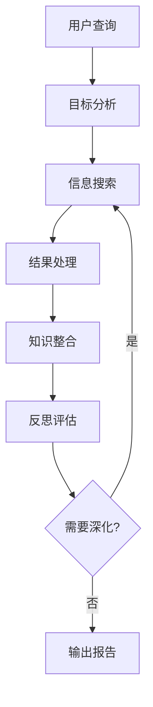

# 📚 第一章：Research Agent 基础概念

## 🧭 导航链接
- [📖 返回主目录](../RESEARCH_AGENT_LEARNING_MANUAL.md)
- [➡️ 下一章：架构设计模式](./chapter-02-architecture-patterns.md)

## ⏰ 学习时间：45分钟

## 🎯 本章目标
- 理解什么是Research Agent及其核心价值
- 掌握Research Agent的基本工作循环
- 了解搜索、总结、反思的核心机制
- 理解自主性与可控性的平衡

---

## 📖 第一部分：什么是Research Agent（15分钟）

### 🤖 核心定义

**Research Agent** 是一种专门设计用于深度研究和信息整合的AI智能体。它不仅仅是简单的问答系统，而是能够：

- 🔍 **主动搜索**：根据研究目标自主生成搜索查询
- 🧠 **深度思考**：对搜索结果进行分析和反思
- 📝 **结构化输出**：生成有条理的研究报告
- 🔄 **迭代优化**：通过多轮反思不断完善结果

### 💡 与传统搜索的区别

| 传统搜索引擎 | Research Agent |
|-------------|----------------|
| 被动响应查询 | 主动提出研究问题 |
| 返回链接列表 | 提供整合答案 |
| 单次交互 | 多轮对话和优化 |
| 无记忆能力 | 保持上下文和状态 |

### 🎯 核心价值主张

1. **深度而非广度**：专注于深入理解而非信息收集
2. **质量而非数量**：追求准确性和相关性
3. **结构而非碎片**：提供有条理的知识组织
4. **洞察而非数据**：提炼观点和见解

---

## 🔍 第二部分：核心工作循环（15分钟）

### 🔄 基础工作流程

### 📋 工作循环详解

#### 1. **目标分析阶段**
- 解析用户意图和研究范围
- 生成初步的研究框架
- 确定关键信息需求

#### 2. **信息搜索阶段**
- 基于目标生成精准搜索查询
- 多源信息采集和验证
- 相关性评分和筛选

#### 3. **结果处理阶段**
- 提取关键信息和观点
- 去重和可信度评估
- 初步知识结构化

#### 4. **知识整合阶段**
- 多源信息融合
- 逻辑关系建立
- 观点形成和论证

#### 5. **反思评估阶段**
- 识别信息缺口
- 评估结论可靠性
- 规划下一步研究方向

### 🎭 反思机制的重要性

反思是Research Agent区别于普通搜索系统的核心特征：

- **自我质疑**：主动发现可能的信息遗漏
- **多角度验证**：从不同角度验证结论
- **深度挖掘**：基于已有信息发现新的研究线索
- **质量保证**：确保研究的完整性和准确性

---

## 🧠 第三部分：核心组件解析（10分钟）

### 🧩 基础架构组件

#### 1. **查询生成器**
- 将模糊需求转化为具体搜索查询
- 基于上下文优化搜索策略
- 动态调整搜索方向

#### 2. **信息处理器**
- 多格式信息解析（文本、图像、表格）
- 关键信息提取和标注
- 可信度评估算法

#### 3. **知识整合器**
- 信息关联和映射
- 逻辑结构构建
- 观点形成和论证

#### 4. **反思引擎**
- 缺口识别算法
- 质量评估机制
- 方向调整策略

#### 5. **状态管理器**
- 上下文保持
- 进度跟踪
- 中间结果存储

### 🔧 关键技术支撑

- **大语言模型**：理解和生成能力
- **搜索API**：实时信息获取
- **向量数据库**：语义检索
- **图算法**：知识关联分析

---

## 🎯 第四部分：实践思考练习（5分钟）

### 💭 思考题

1. **场景分析**：假设你要研究"2025年人工智能发展趋势"，Research Agent会如何工作？请描述完整的工作流程。

2. **对比思考**：Research Agent与传统搜索引擎在处理"分析某公司竞争优势"这类复杂问题时有何本质区别？

3. **设计思考**：如果你要设计一个Research Agent，最关键的三个组件是什么？为什么？

4. **挑战识别**：Research Agent面临的最大技术挑战是什么？如何解决？

### 🔍 实践观察

观察身边的搜索行为：
- 你平时如何进行研究性工作？
- 哪些环节可以自动化？
- 人工研究中最有价值的部分是什么？

---

## 📚 本章小结

### ✅ 核心要点

1. **Research Agent是主动的、迭代的研究助手**
2. **工作循环包含搜索、处理、整合、反思四个核心环节**
3. **反思机制是区别于传统搜索的关键特征**
4. **需要在自主性和可控性之间找到平衡**

### 🚀 下一步

在下一章中，我们将深入探讨不同的架构模式，理解为什么会有不同的设计选择，以及它们各自适用的场景。

### 📖 延伸阅读

- 《人工智能搜索技术演进》
- 《智能体系统的自主性与可控性》
- 《知识图谱在Research Agent中的应用》

---

**⏰ 完成时间检查**：确保你在45分钟内完成了本章学习。如果遇到困难，重点关注核心概念的理解，而非技术细节的掌握。