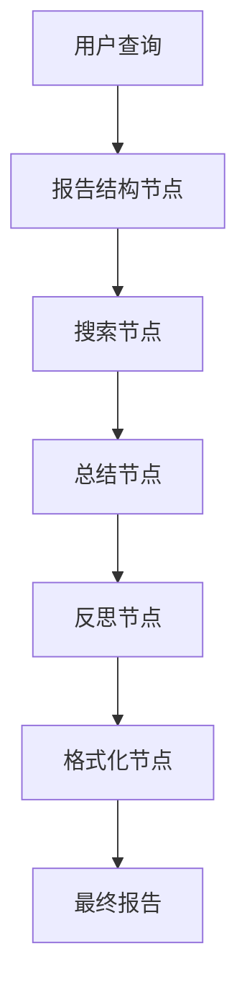
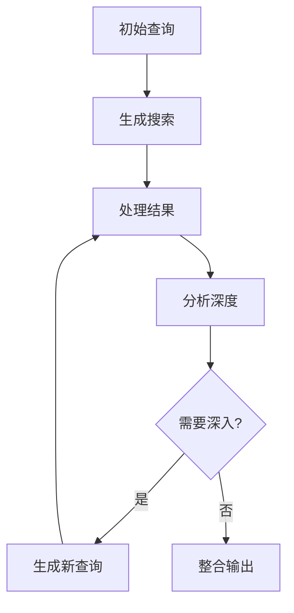
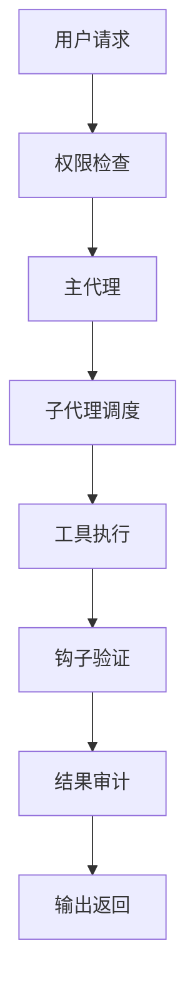

# 📚 第二章：Research Agent 架构模式

## 🧭 导航链接
- [📖 返回主目录](../RESEARCH_AGENT_LEARNING_MANUAL.md)
- [⬅️ 上一章：Research Agent 基础概念](./chapter-01-research-agent-basics.md)
- [➡️ 下一章：三个项目概览](./chapter-03-three-projects-overview.md)

## ⏰ 学习时间：45分钟

## 🎯 本章目标
- 理解三种主要的Research Agent架构模式
- 掌握不同架构的设计哲学和权衡
- 了解架构选择对系统行为的影响
- 学会根据场景选择合适的架构模式

---

## 🏗️ 第一部分：架构模式概览（15分钟）

### 🎭 三种主要架构模式

#### 1. **节点化架构**（Node-based Architecture）
- **代表项目**：DeepSearchAgent-Demo
- **核心思想**：将复杂任务分解为专门的处理节点
- **设计哲学**：职责分离、状态驱动、可预测性

#### 2. **递归架构**（Recursive Architecture）  
- **代表项目**：deep-research
- **核心思想**：通过递归调用实现深度探索
- **设计哲学**：简洁高效、性能优先、快速原型

#### 3. **企业级架构**（Enterprise Architecture）
- **代表项目**：Claude Agent SDK
- **核心思想**：安全可控的生产级系统
- **设计哲学**：企业级特性、安全优先、可观测性

### 📊 架构对比矩阵

| 维度 | 节点化 | 递归 | 企业级 |
|------|--------|------|--------|
| **复杂度** | 中等 | 简单 | 复杂 |
| **可维护性** | 高 | 中等 | 高 |
| **性能** | 中等 | 高 | 中等 |
| **安全性** | 中等 | 低 | 高 |
| **可扩展性** | 高 | 中等 | 高 |
| **学习曲线** | 中等 | 简单 | 陡峭 |
| **适用场景** | 教学原型 | 快速验证 | 生产应用 |

---

## 🧩 第二部分：节点化架构深度解析（10分钟）

### 🎯 设计原理

节点化架构基于**流水线模式**，将复杂的Research Agent流程分解为一系列专门的处理节点：



### 🔧 核心特征

#### 1. **职责分离**
- 每个节点专注于单一功能
- 清晰的输入输出接口
- 易于测试和调试

#### 2. **状态驱动**
- 中央状态管理器
- 节点间通过状态传递信息
- 支持中断和恢复

#### 3. **可预测性**
- 线性执行流程
- 明确的处理步骤
- 易于理解和调试

### 💡 优势分析

✅ **教学友好**：清晰的架构便于学习  
✅ **高度可控**：每个步骤都可以监控和干预  
✅ **易于扩展**：可以轻松添加新节点  
✅ **调试友好**：问题定位容易  

### ⚠️ 局限性

❌ **性能开销**：多节点切换成本  
❌ **灵活性有限**：固定流程难以动态调整  
❌ **资源利用**：串行执行限制并行能力  

---

## 🔄 第三部分：递归架构深度解析（10分钟）

### 🎯 设计原理

递归架构采用**深度优先搜索**策略，通过递归调用实现信息的深度挖掘：



### 🔧 核心特征

#### 1. **简洁设计**
- 核心代码通常<500行
- 最小化抽象层
- 专注核心功能

#### 2. **性能优先**
- 并发搜索能力
- 最小化状态管理
- 高效的资源利用

#### 3. **递归控制**
- 深度和广度参数
- 动态终止条件
- 智能回溯机制

### 💡 优势分析

✅ **高性能**：并发处理能力强  
✅ **快速原型**：开发和迭代速度快  
✅ **易于理解**：代码简洁明了  
✅ **资源高效**：最小化内存占用  

### ⚠️ 局限性

❌ **可控性差**：递归行为难以预测  
❌ **调试困难**：深度嵌套问题定位难  
❌ **状态管理弱**：缺乏完整的状态跟踪  
❌ **安全风险**：无限制的递归可能导致问题  

---

## 🏢 第四部分：企业级架构深度解析（10分钟）

### 🎯 设计原理

企业级架构采用**分层安全模型**，在强大功能的基础上加入严格的安全控制：



### 🔧 核心特征

#### 1. **安全分层**
- 多层权限检查
- Pre/Post执行钩子
- 细粒度访问控制

#### 2. **可观测性**
- 全链路日志追踪
- 性能指标监控
- 错误处理和恢复

#### 3. **模块化设计**
- 子代理专业化
- MCP协议集成
- 标准化工具接口

### 💡 优势分析

✅ **生产就绪**：企业级安全和稳定性  
✅ **高度可控**：精细的权限和流程控制  
✅ **可扩展性强**：标准化接口便于集成  
✅ **运维友好**：完整的监控和调试能力  

### ⚠️ 局限性

❌ **学习成本高**：复杂的概念和配置  
❌ **开发复杂**：需要更多的工程投入  
❌ **性能开销**：安全检查的成本  
❌ **过度设计**：简单场景可能过于复杂  

---

## 🎯 第五部分：架构选择指南（5分钟）

### 🎭 场景驱动的架构选择

#### 选择节点化架构当：
- 🎓 **教学和学习**场景
- 🔧 **需要高度定制**的项目
- 📊 **流程可预测性**要求高
- 🧪 **实验和原型**开发

#### 选择递归架构当：
- ⚡ **性能要求**极高
- 🌐 **快速验证**想法
- 🎯 **简单研究**任务
- 📦 **资源受限**环境

#### 选择企业级架构当：
- 🏢 **生产环境**部署
- 🔒 **安全要求**严格
- 🔧 **复杂集成**需求
- 📊 **长期维护**项目

### 🔄 架构演进路径

```
简单递归 → 节点化结构 → 企业级架构
    ↓           ↓           ↓
 快速原型   →  教学友好  →  生产就绪
```

### 💭 思考练习

1. **场景匹配**：给你三个场景，分别选择最适合的架构：
   - 学术研究助手
   - 企业知识库搜索
   - 个人信息整理工具

2. **权衡分析**：为什么没有"完美"的架构？每种架构都在哪些方面做了权衡？

3. **设计思考**：如果要设计一个Research Agent，你会选择哪种架构作为起点？为什么？

---

## 📚 本章小结

### ✅ 核心要点

1. **三种架构各有优劣，没有绝对的最佳选择**
2. **架构选择应该基于具体场景和需求**
3. **复杂度和功能是重要的权衡维度**
4. **架构演进是常见的开发模式**

### 🚀 下一步

在下一章中，我们将具体分析三个代表项目，看看这些架构模式在实际项目中是如何体现的。

### 📖 延伸阅读

- 《软件架构模式与实践》
- 《AI系统设计原则》
- 《企业级应用架构指南》

---

**⏰ 完成时间检查**：确保你在45分钟内完成了本章学习。重点理解不同架构的设计哲学和适用场景。