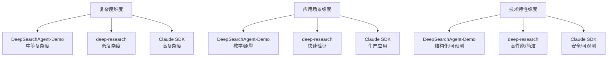
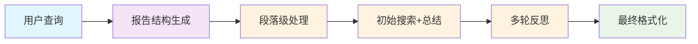
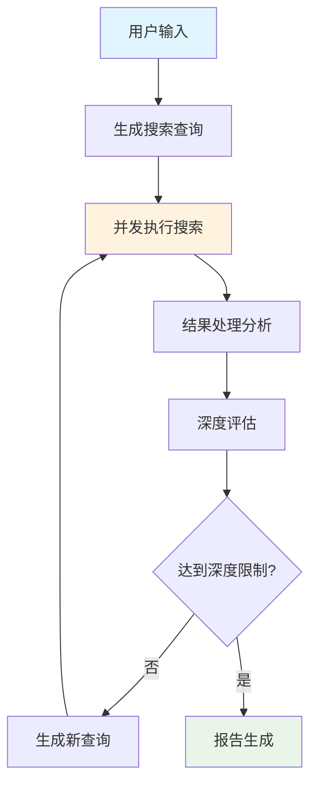
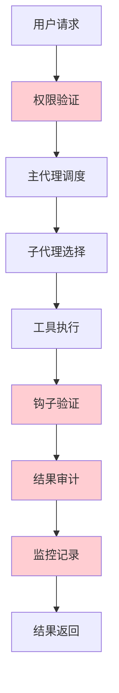
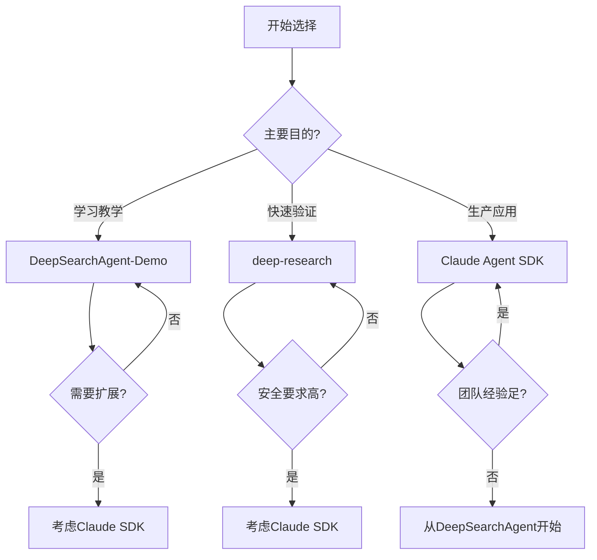

# 📚 第三章：三个代表项目概览

## 🧭 导航链接
- [📖 返回主目录](../RESEARCH_AGENT_LEARNING_MANUAL.md)
- [⬅️ 上一章：架构设计模式](./chapter-02-architecture-patterns.md)
- [➡️ 下一章：节点式架构](../phase-02-deepsearchagent-demo/chapter-04-node-based-architecture.md)

## ⏰ 学习时间：45分钟

## 🎯 本章目标
- 全面了解三个代表项目的核心特点
- 理解每个项目的设计哲学和目标用户
- 掌握项目间的关键差异和互补性
- 为后续深入学习建立整体认知框架

---

## 🌟 第一部分：项目全景图（15分钟）

### 🎭 三个项目的定位

#### 🎓 DeepSearchAgent-Demo：教学原型
- **角色定位**：Research Agent的学习和教学工具
- **核心价值**：清晰的架构设计，便于理解核心概念
- **目标用户**：AI学习者、研究人员、教育工作者
- **设计理念**：可理解性 > 性能 > 功能完整性

#### ⚡ deep-research：效率工具
- **角色定位**：高性能的研究助手
- **核心价值**：快速、简洁、高效的研究能力
- **目标用户**：开发者、研究人员、快速原型验证者
- **设计理念**：性能 > 简洁性 > 功能丰富度

#### 🏢 Claude Agent SDK：企业平台
- **角色定位**：生产级Agent开发框架
- **核心价值**：安全、可控、可扩展的企业级能力
- **目标用户**：企业开发者、产品团队、系统集成商
- **设计理念**：安全性 > 可控性 > 功能完整性

### 📊 三维对比分析

---

## 🎓 第二部分：DeepSearchAgent-Demo 深度解析（10分钟）

### 🏗️ 架构特点

#### 核心设计原则
1. **教育导向**：每个设计决策都考虑教学价值
2. **模块化设计**：清晰的组件边界和职责分工
3. **状态可视化**：完整的状态管理和进度跟踪
4. **扩展友好**：易于添加新功能和LLM支持

#### 技术栈选择
- **Python**：教育友好的编程语言
- **Streamlit**：快速Web界面开发
- **模块化设计**：src/llms/, src/nodes/, src/state/等清晰分层
- **配置驱动**：灵活的参数配置系统

### 🎯 核心工作流程

### 💡 教学价值

#### 概念清晰性
- **节点抽象**：每个处理步骤都有明确的节点对应
- **状态管理**：完整的状态数据结构便于理解
- **配置系统**：参数化设计展示系统可调性

#### 学习友好性
- **丰富注释**：代码中包含详细的设计说明
- **示例完整**：从基础到高级的完整示例
- **错误处理**：清晰的错误信息和调试支持

### 🎭 适用场景分析

#### ✅ 最佳适用场景
- 📚 **学术教学**：AI课程的教学案例
- 🧪 **概念验证**：Research Agent概念的原型实现
- 🔧 **功能实验**：新算法和功能的试验平台
- 📖 **文档编写**：技术文档和教程的配套代码

#### ⚠️ 局限性认知
- 🐌 **性能限制**：教育优先，非性能优化
- 🔒 **安全考虑**：缺乏企业级安全特性
- 📈 **扩展性**：简单的扩展机制，不适合大规模应用

---

## ⚡ 第三部分：deep-research 深度解析（10分钟）

### 🎯 设计哲学

#### 极简主义原则
1. **核心功能优先**：只实现最关键的研究功能
2. **代码量控制**：保持<500行核心代码
3. **最小依赖**：减少外部依赖和复杂性
4. **性能导向**：优化执行速度和资源利用

#### 技术特点
- **Node.js生态**：利用JavaScript生态系统的优势
- **并发处理**：原生支持并行搜索和处理
- **递归设计**：简洁的递归算法实现深度探索
- **配置驱动**：深度和广度参数控制研究范围

### 🔄 核心工作机制

### 💡 核心优势

#### 性能优势
- **并发搜索**：同时执行多个搜索查询
- **内存效率**：最小化状态存储
- **快速启动**：简单初始化，快速响应

#### 开发优势
- **易于理解**：简洁的代码结构
- **快速迭代**：修改和测试周期短
- **部署简单**：最小化的依赖和配置

### 🎭 适用场景分析

#### ✅ 最佳适用场景
- ⚡ **快速原型**：想法的快速验证和测试
- 🔍 **个人研究**：个人项目和研究需求
- 📦 **资源受限**：计算资源有限的环境
- 🧪 **算法实验**：搜索算法的实验平台

#### ⚠️ 局限性认知
- 🔒 **安全缺失**：缺乏企业级安全控制
- 📊 **监控不足**：有限的调试和监控能力
- 🔧 **扩展困难**：极简设计限制了功能扩展

---

## 🏢 第四部分：Claude Agent SDK 深度解析（10分钟）

### 🎯 企业级设计理念

#### 核心设计原则
1. **安全第一**：多层安全控制和权限管理
2. **可观测性**：完整的监控、日志和调试能力
3. **可扩展性**：标准化的接口和生态集成
4. **生产就绪**：企业级的稳定性和可靠性

#### 技术架构特点
- **子代理系统**：专业化的任务分解和执行
- **MCP协议**：标准化的工具和集成生态
- **钩子系统**：精细的流程控制和干预
- **内存管理**：智能的上下文压缩和状态管理

### 🏗️ 企业级架构

### 💡 企业级特性

#### 安全特性
- **多层权限**：工具级、会话级、全局级权限控制
- **Pre/Post钩子**：执行前后的安全检查和验证
- **审计日志**：完整的操作记录和追踪能力

#### 可观测性特性
- **全链路追踪**：请求到响应的完整追踪
- **性能监控**：延迟、吞吐量、错误率监控
- **错误处理**：完善的错误捕获和恢复机制

#### 生态集成
- **MCP协议**：标准化的工具和服务集成
- **IDE集成**：VSCode等开发环境的深度集成
- **CI/CD支持**：企业级持续集成和部署

### 🎭 适用场景分析

#### ✅ 最佳适用场景
- 🏢 **企业应用**：生产环境的Agent系统
- 🔒 **安全敏感**：需要严格安全控制的项目
- 🔧 **复杂集成**：需要与多个系统集成的场景
- 📊 **长期维护**：需要长期支持和维护的产品

#### ⚠️ 局限性认知
- 🎓 **学习成本**：复杂的概念和配置要求
- ⏱️ **开发周期**：企业级特性增加开发复杂度
- 💰 **资源消耗**：安全控制的性能开销

---

## 🎯 第五部分：项目对比与选择指南（5分钟）

### 📊 综合对比矩阵

| 维度 | DeepSearchAgent-Demo | deep-research | Claude Agent SDK |
|------|---------------------|---------------|------------------|
| **学习曲线** | 🟢 中等 | 🟢 简单 | 🔴 陡峭 |
| **开发速度** | 🟡 中等 | 🟢 快速 | 🔴 较慢 |
| **性能表现** | 🟡 中等 | 🟢 优秀 | 🟡 中等 |
| **安全控制** | 🟡 基础 | 🔴 有限 | 🟢 完善 |
| **可扩展性** | 🟢 良好 | 🟡 有限 | 🟢 优秀 |
| **维护成本** | 🟢 较低 | 🟢 低 | 🔴 较高 |
| **生产就绪** | 🔴 不足 | 🔴 不足 | 🟢 完善 |

### 🎭 选择决策树

### 💭 思考练习

1. **场景匹配**：给你以下三个场景，分别选择最适合的项目：
   - 大学研究生的AI课程项目
   - 创业公司的MVP产品验证
   - 大型企业的客服自动化系统

2. **演进路径**：如果你要开发一个Research Agent产品，会如何在这三个项目间选择和演进？

3. **优势互补**：这三个项目能否互相借鉴？你希望从每个项目中学习什么？

---

## 📚 本章小结

### ✅ 核心要点

1. **三个项目代表了Research Agent发展的不同阶段和方向**
2. **没有绝对的最佳选择，只有最适合特定场景的选择**
3. **项目间的差异反映了不同的设计哲学和目标用户**
4. **理解项目差异有助于在实际开发中做出正确的技术选择**

### 🚀 下一步

从下一章开始，我们将深入学习每个项目的具体实现，首先从DeepSearchAgent-Demo开始。

### 📖 延伸阅读

- 《软件项目架构设计模式》
- 《AI产品开发方法论》
- 《企业级系统设计原则》

---

**⏰ 完成时间检查**：确保你在45分钟内完成了本章学习。重点理解三个项目的定位差异和选择逻辑。