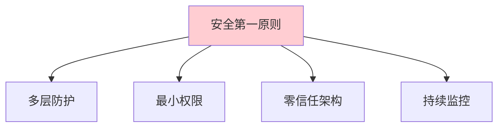
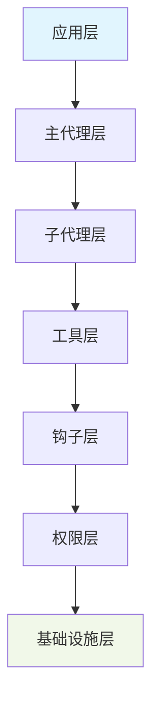
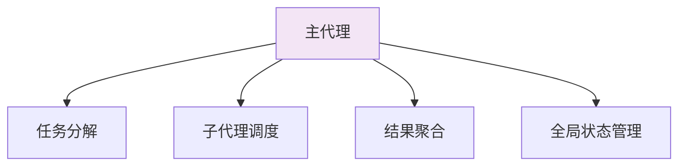
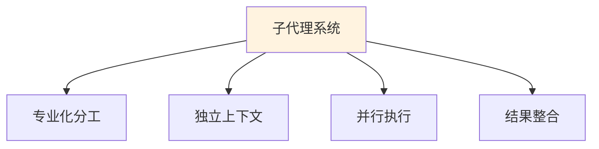
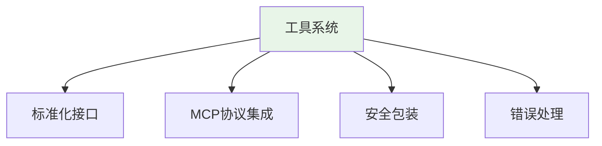
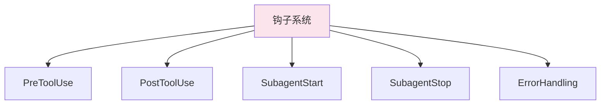
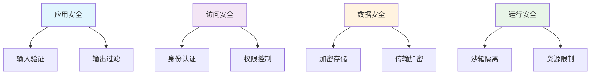
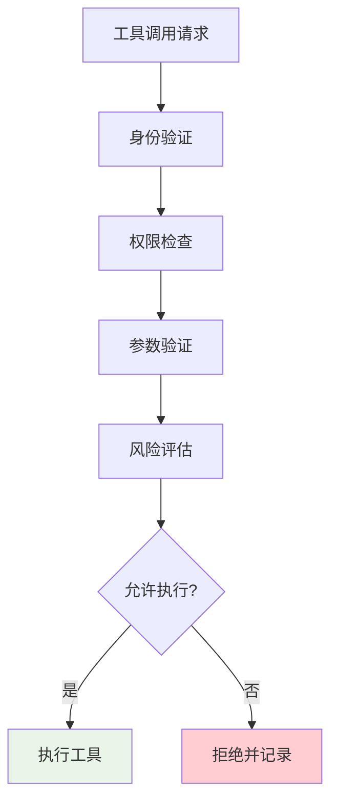

# 📚 第十章：Claude Agent SDK 企业级架构

## 🧭 导航链接
- [📖 返回主目录](../RESEARCH_AGENT_LEARNING_MANUAL.md)
- [⬅️ 上一章：极简主义方法](../phase-02-deep-research/chapter-09-minimalist-approach.md)
- [➡️ 下一章：安全与权限](./chapter-11-security-permissions.md)

## ⏰ 学习时间：45分钟

## 🎯 本章目标
- 深入理解企业级Research Agent架构的设计原则
- 掌握Claude Agent SDK的核心架构组件
- 分析企业级特性对系统可靠性和安全性的影响
- 理解生产环境下的架构权衡和设计决策

---

## 🏢 第一部分：企业级架构设计原则（15分钟）

### 🎯 企业级需求分析

企业级Research Agent面临独特的挑战和要求：

#### 1. **安全性要求**
- 数据隐私保护
- 访问权限控制
- 审计和合规性
- 安全漏洞防护

#### 2. **可靠性要求**
- 7x24小时稳定运行
- 故障自动恢复
- 数据一致性保障
- 服务降级策略

#### 3. **可扩展性要求**
- 水平扩展能力
- 模块化设计
- 插件化架构
- 标准化接口

#### 4. **可观测性要求**
- 全链路监控
- 性能指标收集
- 错误追踪和分析
- 运维友好性

### 🏗️ 企业级架构核心原则

#### 1. **安全第一（Security First）**


#### 2. **可观测性优先（Observability First）**
- 可观测的架构设计
- 内置监控和日志
- 性能指标暴露
- 调试友好性

#### 3. **模块化设计（Modular Design）**
- 清晰的模块边界
- 标准化接口
- 松耦合架构
- 独立部署能力

#### 4. **渐进式复杂度（Progressive Complexity）**
- 简单场景简单配置
- 复杂场景完整支持
- 学习曲线平滑
- 配置层次化

---

## 🧩 第二部分：Claude Agent SDK 核心架构（15分钟）

### 🎯 整体架构概览

Claude Agent SDK采用分层的企业级架构：



### 🎭 核心组件详解

#### 1. **主代理（Orchestrator）**


**核心职责**：
- 接收用户请求和目标
- 将复杂任务分解为子任务
- 选择合适的子代理执行任务
- 协调子代理间的协作
- 聚合和整合子任务结果

#### 2. **子代理系统（Sub-agents）**


**设计特点**：
- **专业化**：每个子代理专注特定领域
- **独立性**：独立的上下文窗口和状态
- **可组合**：支持灵活的组合和编排
- **可扩展**：易于添加新的子代理类型

#### 3. **工具系统（Tools System）**


**核心特性**：
- **统一接口**：所有工具使用相同的调用接口
- **MCP集成**：支持Model Context Protocol标准
- **安全控制**：工具级别的权限和访问控制
- **异步执行**：支持并发和异步工具调用

#### 4. **钩子系统（Hooks System）**


**钩子类型**：
- **PreToolUse**：工具执行前的验证和控制
- **PostToolUse**：工具执行后的处理和审计
- **SubagentStart**：子代理启动时的初始化
- **SubagentStop**：子代理结束时的清理
- **ErrorHandling**：错误发生时的处理策略

---

## 🔒 第三部分：安全架构设计（10分钟）

### 🛡️ 多层安全防护

#### 安全层次模型


#### 权限控制机制
```python
class PermissionManager:
    def __init__(self):
        self.permissions = {
            'tool_access': {},
            'file_access': {},
            'network_access': {},
            'system_access': {}
        }
    
    def check_permission(self, agent_id, resource, action):
        """检查权限"""
        
        # 1. 检查静态权限规则
        if not self.static_check(agent_id, resource, action):
            return False
        
        # 2. 检查动态权限策略
        if not self.dynamic_check(agent_id, resource, action):
            return False
        
        # 3. 执行钩子验证
        if not self.hook_check(agent_id, resource, action):
            return False
        
        return True
```

### 🔍 安全钩子实现

#### PreToolUse安全检查


#### 安全策略示例
```json
{
  "security_policies": {
    "file_operations": {
      "allowed_paths": ["/workspace", "/tmp"],
      "forbidden_patterns": [".env", "*.key", "secrets/"],
      "max_file_size": "10MB"
    },
    "network_operations": {
      "allowed_domains": ["api.openai.com", "tavily.com"],
      "max_requests_per_minute": 100,
      "timeout": 30
    },
    "tool_usage": {
      "require_approval": ["bash", "write_file"],
      "audit_all": true
    }
  }
}
```

---

## 🎯 第四部分：企业级特性的教学价值（5分钟）

### 🎓 为什么学习企业级架构？

#### 1. **系统性思维**
- 理解复杂系统的设计原则
- 学习权衡和平衡的设计决策
- 掌握系统性问题的解决方法

#### 2. **工程实践**
- 了解生产环境的真实需求
- 学习企业级开发的最佳实践
- 掌握安全和可靠性的设计方法

#### 3. **职业发展**
- 企业级开发是高价值技能
- 理解架构设计有助于技术决策
- 为大型项目开发做好准备

### 📚 学习价值分析

#### 概念学习价值
- **安全设计**：理解安全在系统设计中的核心地位
- **可观测性**：学习监控和调试的设计思想
- **模块化**：掌握大型系统的组织方法

#### 实践应用价值
- **项目架构**：为实际项目提供架构参考
- **技术选型**：理解不同技术方案的权衡
- **问题解决**：学习复杂问题的解决思路

### 💭 思考练习

1. **架构权衡**：在Claude Agent SDK中，安全和性能之间是如何平衡的？

2. **简化思考**：如果要创建一个"轻量版"的Claude SDK，你会保留哪些核心特性？

3. **应用场景**：什么样的Research Agent应用真正需要企业级架构？

---

## 📚 本章小结

### ✅ 核心要点

1. **企业级架构以安全性、可靠性、可扩展性为核心目标**
2. **Claude Agent SDK通过分层架构实现了复杂系统的有效组织**
3. **多层安全防护和钩子机制确保了系统的安全性**
4. **企业级特性为生产环境的Research Agent提供了完整的解决方案**

### 🚀 下一步

在下一章中，我们将深入学习Claude Agent SDK的安全权限系统，了解企业级安全的具体实现。

### 📖 延伸阅读

- 《企业级软件架构设计》
- 《安全系统设计原理》
- 《大规模系统架构实践》

---

**⏰ 完成时间检查**：确保你在45分钟内完成了本章学习。重点理解企业级架构的设计原则和实现方法。