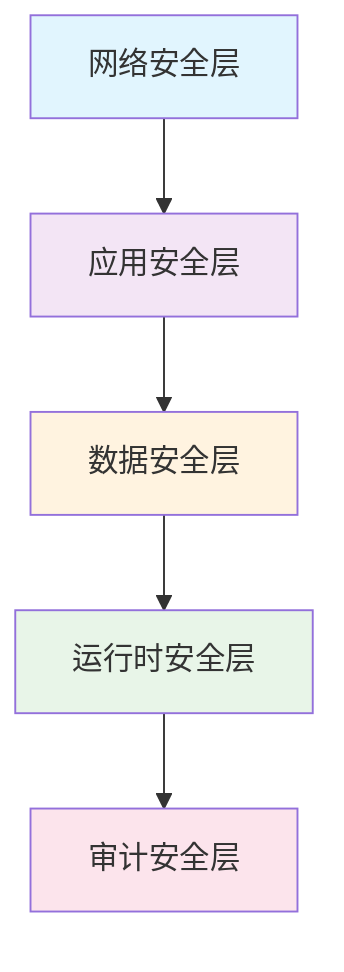
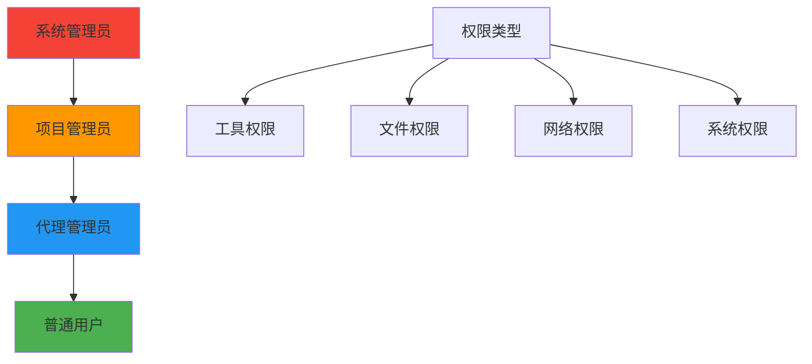
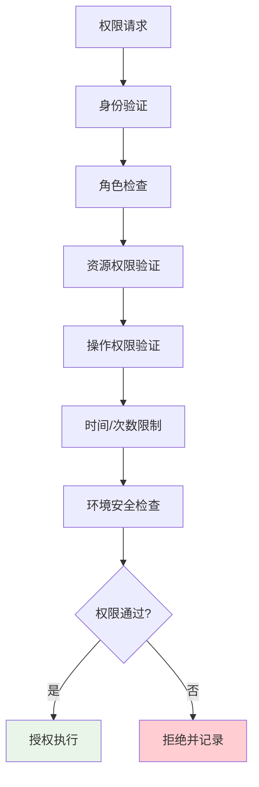
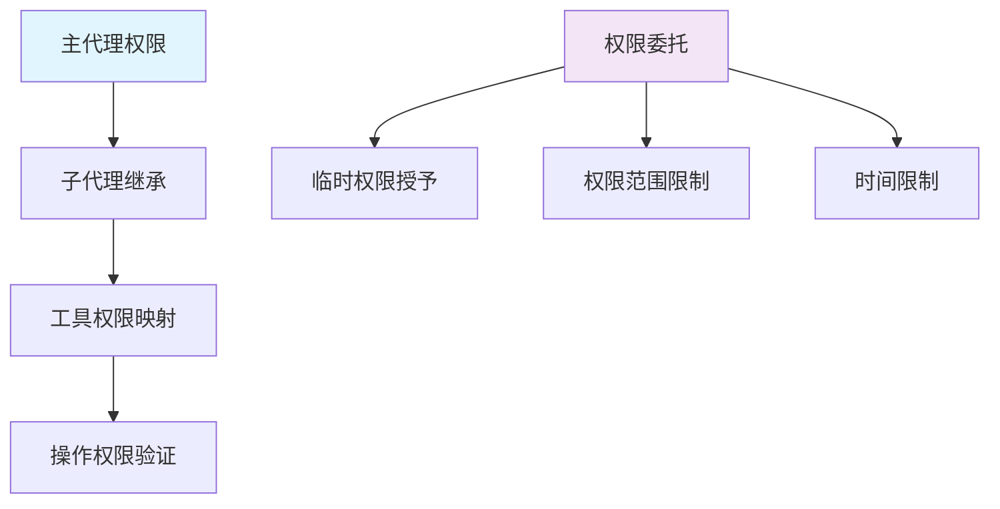
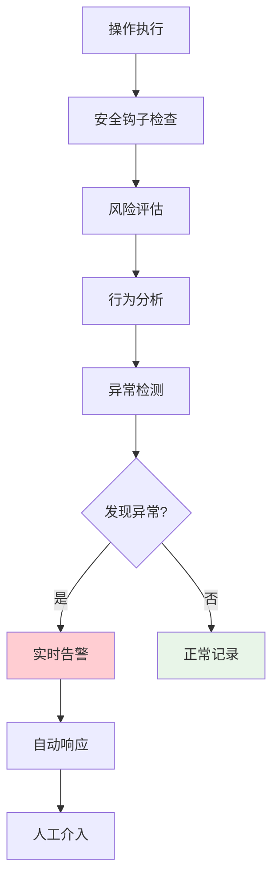
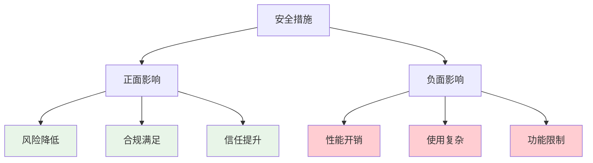

# 📚 第十一章：Claude Agent SDK 安全权限系统

## 🧭 导航链接
- [📖 返回主目录](../RESEARCH_AGENT_LEARNING_MANUAL.md)
- [⬅️ 上一章：企业级架构](./chapter-10-enterprise-architecture.md)
- [➡️ 下一章：MCP 生态系统](./chapter-12-mcp-ecosystem.md)

## ⏰ 学习时间：45分钟

## 🎯 本章目标
- 深入理解企业级Research Agent的安全架构设计
- 掌握Claude Agent SDK的权限控制机制
- 分析钩子系统在安全防护中的作用
- 理解安全与功能性的平衡策略

---

## 🔒 第一部分：安全架构基础（15分钟）

### 🎯 企业级安全需求

在Research Agent中，安全性是首要考虑因素：

#### 1. **数据安全**
- 敏感信息保护
- 数据加密存储
- 访问日志记录
- 数据泄露防护

#### 2. **操作安全**
- 危险操作限制
- 权限最小化原则
- 操作审计追踪
- 异常行为检测

#### 3. **系统安全**
- 沙箱隔离执行
- 资源访问控制
- 网络访问限制
- 恶意代码防护

#### 4. **合规安全**
- 行业标准遵循
- 审计要求满足
- 隐私保护法规
- 安全认证支持

### 🏗️ 安全架构层次

#### 纵深防御模型


#### 防御策略
- **多层防护**：不同层次的安全措施
- **冗余保护**：关键安全机制的多重保障
- **动态调整**：根据威胁级别调整安全策略
- **快速响应**：安全事件的快速检测和响应

---

## 🛡️ 第二部分：权限控制系统（15分钟）

### 🎯 权限模型设计

Claude Agent SDK采用基于角色的访问控制（RBAC）模型：

#### 权限层次结构


#### 权限控制流程


### 🔧 权限实现机制

#### 1. **静态权限配置**
```json
{
  "roles": {
    "admin": {
      "description": "系统管理员",
      "permissions": ["*"],
      "tools": ["*"],
      "files": ["*"],
      "network": ["*"]
    },
    "developer": {
      "description": "开发者",
      "permissions": ["read", "write", "execute"],
      "tools": ["bash", "file_ops", "search"],
      "files": ["/workspace/**", "/tmp/**"],
      "network": ["api.openai.com", "github.com"]
    },
    "user": {
      "description": "普通用户",
      "permissions": ["read", "execute"],
      "tools": ["search", "read_file"],
      "files": ["/workspace/user/**"],
      "network": ["api.openai.com"]
    }
  }
}
```

#### 2. **动态权限策略**
```python
class DynamicPermissionChecker:
    def __init__(self):
        self.policies = {}
        self.context = {}
    
    def check_permission(self, agent_id, resource, action, context):
        """动态权限检查"""
        
        # 基础权限检查
        if not self.base_permission_check(agent_id, resource, action):
            return False
        
        # 上下文相关检查
        if not self.context_check(agent_id, resource, action, context):
            return False
        
        # 时间窗口检查
        if not self.time_window_check(agent_id, resource, action):
            return False
        
        # 风险评估
        risk_score = self.assess_risk(agent_id, resource, action, context)
        if risk_score > RISK_THRESHOLD:
            return self.require_approval(agent_id, resource, action)
        
        return True
```

#### 3. **权限继承和委托**


---

## 🪝 第三部分：钩子安全系统（10分钟）

### 🎯 钩子机制的安全价值

钩子系统是Claude Agent SDK安全架构的核心组件：

#### 钩子类型和安全作用
| 钩子类型 | 安全作用 | 典型场景 |
|----------|----------|----------|
| **PreToolUse** | 执行前验证 | 危险操作检查、参数验证 |
| **PostToolUse** | 执行后审计 | 结果检查、日志记录 |
| **SubagentStart** | 启动安全检查 | 环境验证、权限确认 |
| **SubagentStop** | 结束清理 | 资源释放、状态保存 |
| **ErrorHandling** | 异常安全处理 | 错误隔离、安全恢复 |

### 🔧 安全钩子实现

#### 1. **PreToolUse安全钩子**
```python
async def pre_tool_security_hook(tool_name, tool_input, context):
    """工具使用前的安全检查"""
    
    # 1. 危险操作检测
    dangerous_patterns = [
        r'rm\s+-rf',
        r'sudo\s+',
        r'chmod\s+777',
        r'curl.*\|.*sh'
    ]
    
    input_str = str(tool_input)
    for pattern in dangerous_patterns:
        if re.search(pattern, input_str):
            return {
                'decision': 'block',
                'reason': f'检测到危险操作模式: {pattern}',
                'severity': 'high'
            }
    
    # 2. 敏感文件保护
    if 'file_path' in tool_input:
        file_path = tool_input['file_path']
        protected_paths = [
            '/etc/', '/sys/', '/proc/',
            '.env', '*.key', 'secrets/'
        ]
        
        for protected in protected_paths:
            if protected in file_path:
                return {
                    'decision': 'block',
                    'reason': f'尝试访问受保护路径: {protected}',
                    'severity': 'high'
                }
    
    # 3. 资源使用检查
    if tool_name == 'bash':
        command = tool_input.get('command', '')
        if 'network' in command.lower():
            # 检查网络访问权限
            if not context.get('network_allowed', False):
                return {
                    'decision': 'ask',
                    'reason': '尝试网络访问，需要用户确认',
                    'severity': 'medium'
                }
    
    return {'decision': 'allow'}
```

#### 2. **PostToolUse审计钩子**
```python
async def post_tool_audit_hook(tool_name, tool_input, tool_output, context):
    """工具使用后的审计记录"""
    
    audit_record = {
        'timestamp': datetime.utcnow().isoformat(),
        'agent_id': context.get('agent_id'),
        'tool_name': tool_name,
        'tool_input': sanitize_input(tool_input),
        'tool_output': sanitize_output(tool_output),
        'execution_time': context.get('execution_time'),
        'success': context.get('success', True),
        'risk_score': calculate_risk_score(tool_name, tool_input, tool_output)
    }
    
    # 记录审计日志
    await audit_logger.log(audit_record)
    
    # 异常行为检测
    if audit_record['risk_score'] > ANOMALY_THRESHOLD:
        await security_alert_manager.alert(
            'high_risk_operation',
            audit_record
        )
    
    # 资源使用统计
    await resource_tracker.update_usage(
        context.get('agent_id'),
        tool_name,
        context.get('resource_usage')
    )
```

### 🔍 安全监控和告警

#### 实时安全监控


#### 告警策略
- **低风险**：记录日志，定期报告
- **中风险**：实时通知，需要确认
- **高风险**：立即阻断，安全团队介入
- **严重风险**：系统隔离，紧急响应

---

## 🎯 第四部分：安全与功能性的平衡（5分钟）

### ⚖️ 安全权衡分析

#### 安全措施的影响


#### 平衡策略
1. **分层安全**：核心功能强安全，辅助功能轻安全
2. **可配置安全**：根据需求调整安全级别
3. **渐进式授权**：从低权限逐步提升
4. **用户教育**：帮助用户理解安全价值

### 💡 最佳实践建议

#### 安全设计原则
- **默认安全**：默认配置是安全的
- **最小权限**：只给予必要的权限
- **透明可控**：安全措施可见可控制
- **持续改进**：安全机制持续优化

#### 实施建议
- **风险评估**：定期评估安全风险
- **权限审查**：定期审查和清理权限
- **安全培训**：提升团队安全意识
- **应急准备**：准备安全事件响应计划

### 💭 思考练习

1. **权限设计**：如何为Research Agent设计一个既安全又灵活的权限系统？

2. **钩子扩展**：如果要添加一个新的安全钩子，应该关注哪些方面？

3. **平衡思考**：在安全性和用户体验之间，如何找到合适的平衡点？

---

## 📚 本章小结

### ✅ 核心要点

1. **企业级安全需要多层次、全方位的防护体系**
2. **权限控制系统是安全架构的核心组件**
3. **钩子机制提供了灵活的安全检查和审计能力**
4. **安全与功能性需要在实际应用中找到平衡**

### 🚀 下一步

在下一章中，我们将学习Claude Agent SDK的MCP生态系统，了解标准化工具集成的价值。

### 📖 延伸阅读

- 《企业级安全架构设计》
- 《权限控制系统设计与实现》
- 《安全钩子机制最佳实践》

---

**⏰ 完成时间检查**：确保你在45分钟内完成了本章学习。重点理解安全架构的设计思想和实现方法。