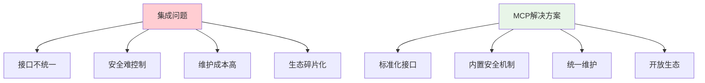
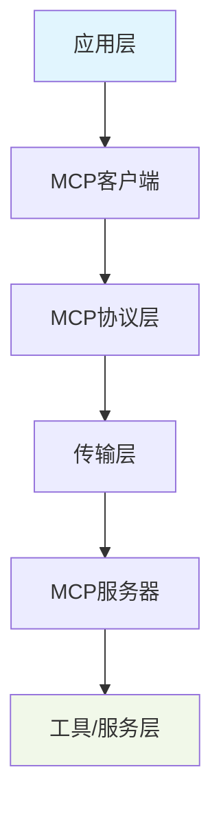
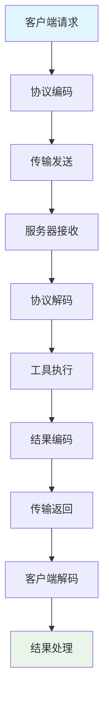
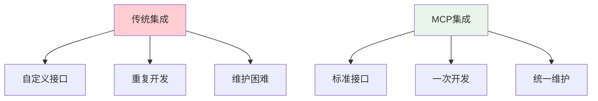
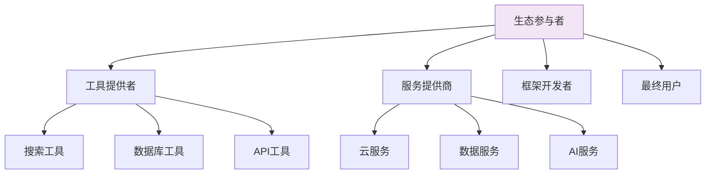
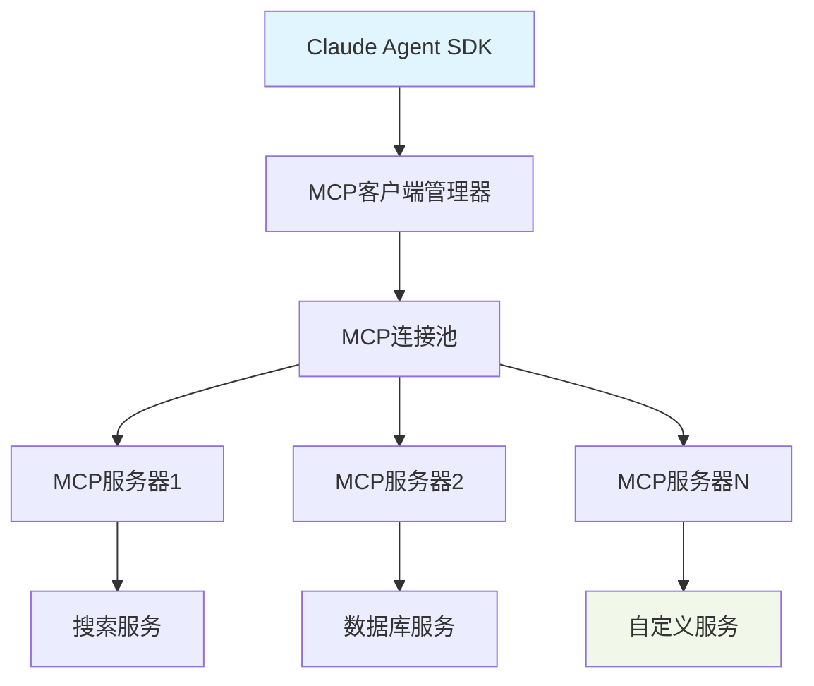
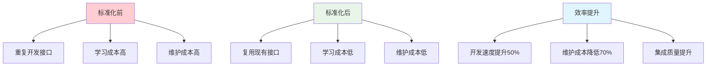
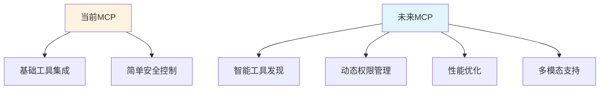

# 📚 第十二章：Claude Agent SDK MCP 生态系统

## 🧭 导航链接
- [📖 返回主目录](../RESEARCH_AGENT_LEARNING_MANUAL.md)
- [⬅️ 上一章：安全权限系统](./chapter-11-security-permissions.md)
- [➡️ 下一章：生产部署](../phase-03-advanced/chapter-13-production-deployment.md)

## ⏰ 学习时间：45分钟

## 🎯 本章目标
- 深入理解MCP（Model Context Protocol）的设计理念和价值
- 掌握MCP在Research Agent生态系统中的作用
- 分析标准化协议对工具集成和扩展的影响
- 理解开放生态系统的构建策略

---

## 🌐 第一部分：MCP协议基础（15分钟）

### 🎯 什么是MCP？

MCP（Model Context Protocol）是一个开放标准协议，旨在解决AI模型与工具和服务之间的集成问题：

#### 核心设计理念
- **标准化接口**：统一的工具和服务接入标准
- **语言无关**：支持多种编程语言和平台
- **安全可控**：内置安全和权限控制机制
- **可扩展性**：支持自定义工具和服务扩展

#### 解决的核心问题


### 🏗️ MCP架构设计

#### 协议层次结构


#### 核心组件
1. **MCP客户端**：集成到AI应用中的协议实现
2. **MCP服务器**：提供具体工具或服务的协议实现
3. **传输层**：支持多种传输方式（STDIO、HTTP、WebSocket等）
4. **协议层**：定义消息格式、调用规范、错误处理

### 📡 MCP通信机制

#### 消息格式标准
```json
{
  "jsonrpc": "2.0",
  "id": "req-001",
  "method": "tools/call",
  "params": {
    "name": "search_web",
    "arguments": {
      "query": "AI research trends 2025",
      "max_results": 10
    }
  }
}
```

#### 通信流程


---

## 🔧 第二部分：MCP在Research Agent中的应用（15分钟）

### 🎯 工具集成标准化

#### 传统集成方式 vs MCP集成


#### MCP工具集成示例
```python
# MCP服务器实现
class WebSearchMCPServer:
    def __init__(self):
        self.tools = {
            "search_web": {
                "name": "search_web",
                "description": "在网络上搜索信息",
                "inputSchema": {
                    "type": "object",
                    "properties": {
                        "query": {"type": "string"},
                        "max_results": {"type": "integer", "default": 5}
                    },
                    "required": ["query"]
                }
            }
        }
    
    async def call_tool(self, name: str, arguments: dict):
        if name == "search_web":
            return await self.search_web(
                arguments["query"], 
                arguments.get("max_results", 5)
            )
        raise ValueError(f"Unknown tool: {name}")
    
    async def search_web(self, query: str, max_results: int):
        # 实际的搜索逻辑
        results = await perform_search(query, max_results)
        return {
            "content": [{
                "type": "text",
                "text": format_search_results(results)
            }]
        }
```

### 🌍 生态系统构建

#### MCP生态参与者


#### 生态系统价值
1. **工具提供者**：一次开发，多处使用
2. **服务提供商**：标准化接入，降低集成成本
3. **框架开发者**：丰富的工具生态，增强竞争力
4. **最终用户**：更多选择，更好体验

### 🔄 Claude Agent SDK中的MCP集成

#### 集成架构


#### 工具调用流程
```python
class MCPToolManager:
    def __init__(self):
        self.servers = {}
        self.tools = {}
    
    async def register_server(self, name: str, server_config: dict):
        """注册MCP服务器"""
        server = MCPServer(server_config)
        await server.connect()
        self.servers[name] = server
        
        # 注册工具
        tools = await server.list_tools()
        for tool in tools:
            self.tools[tool.name] = {
                'server': name,
                'tool': tool
            }
    
    async def call_tool(self, tool_name: str, arguments: dict):
        """调用MCP工具"""
        if tool_name not in self.tools:
            raise ValueError(f"Tool not found: {tool_name}")
        
        tool_info = self.tools[tool_name]
        server = self.servers[tool_info['server']]
        
        return await server.call_tool(tool_name, arguments)
```

---

## 📈 第三部分：MCP生态系统的价值和影响（10分钟）

### 🎯 标准化的价值

#### 开发效率提升


#### 生态系统繁荣
- **降低门槛**：更多人可以参与工具开发
- **促进创新**：专注于功能创新而非接口设计
- **网络效应**：更多工具吸引更多用户
- **正反馈循环**：生态繁荣促进标准完善

### 🔒 安全和可信度

#### 内置安全机制
```python
# MCP安全特性示例
class SecureMCPServer:
    def __init__(self):
        self.permissions = {}
        self.audit_log = []
    
    async def call_tool(self, name: str, arguments: dict, context: dict):
        # 1. 权限检查
        if not self.check_permission(context['user_id'], name):
            raise PermissionError("Insufficient permissions")
        
        # 2. 参数验证
        self.validate_arguments(name, arguments)
        
        # 3. 执行工具
        result = await self.execute_tool(name, arguments)
        
        # 4. 审计记录
        self.log_execution(name, arguments, result, context)
        
        return result
    
    def check_permission(self, user_id: str, tool_name: str) -> bool:
        user_permissions = self.permissions.get(user_id, {})
        return tool_name in user_permissions.get('allowed_tools', [])
```

#### 可信度建立
- **标准认证**：官方认证的MCP服务器
- **社区评价**：用户评分和反馈机制
- **安全审计**：定期的安全审查
- **透明度**：开源实现和公开文档

### 🚀 未来发展方向

#### 技术演进


#### 生态扩展
- **更多工具类型**：图像、音频、视频处理工具
- **垂直领域**：医疗、金融、法律等专业工具
- **AI原生工具**：专门为AI应用设计的工具
- **跨平台支持**：移动端、边缘设备支持

---

## 🎯 第四部分：MCP的学习和应用价值（5分钟）

### 🎓 为什么学习MCP很重要？

#### 1. **标准化思维**
- 理解标准化在技术生态中的价值
- 学习如何设计和推广技术标准
- 掌握标准化带来的商业价值

#### 2. **生态系统建设**
- 学习如何构建技术生态系统
- 理解网络效应和平台经济
- 掌握开放 vs 封闭的策略选择

#### 3. **架构设计能力**
- 学习可扩展的架构设计
- 理解接口设计的重要性
- 掌握向后兼容的设计原则

### 📚 实际应用价值

#### 对开发者的价值
- **技能提升**：掌握前沿的集成技术
- **效率提升**：快速集成各种工具和服务
- **机会增加**：参与生态建设的更多机会

#### 对企业的价值
- **成本降低**：减少定制开发成本
- **风险降低**：使用成熟的标准技术
- **创新加速**：专注于业务逻辑创新

### 💭 思考练习

1. **标准设计**：如果你要设计一个新的技术标准，会从哪些方面考虑？

2. **生态建设**：如何促进一个技术生态系统的繁荣发展？

3. **平衡思考**：在标准化和创新之间，如何找到平衡点？

---

## 📚 本章小结

### ✅ 核心要点

1. **MCP通过标准化接口解决了AI工具集成的核心问题**
2. **开放生态系统为Research Agent提供了丰富的工具选择**
3. **标准化带来了开发效率提升和生态繁荣**
4. **MCP代表了AI系统集成的未来发展方向**

### 🚀 下一步

在第三阶段中，我们将学习Research Agent的高级特性和最佳实践，了解如何构建生产级的Research Agent系统。

### 📖 延伸阅读

- 《MCP协议规范文档》
- 《技术生态系统建设指南》
- 《开放标准最佳实践》

---

**⏰ 完成时间检查**：确保你在45分钟内完成了本章学习。重点理解MCP的设计理念和生态系统价值。