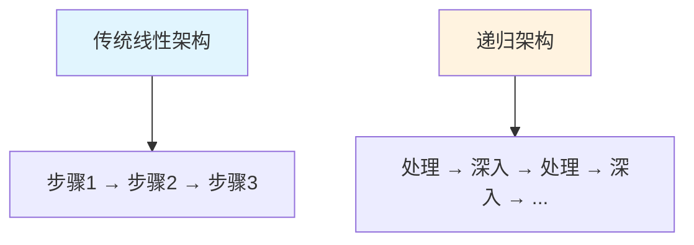
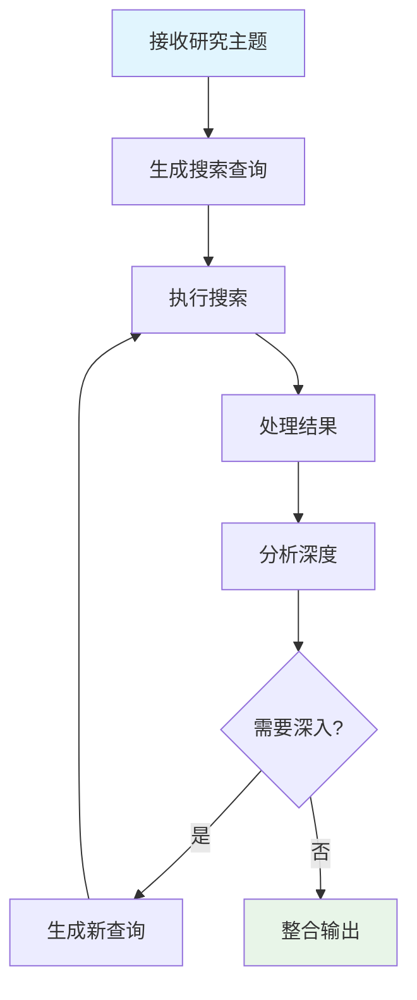
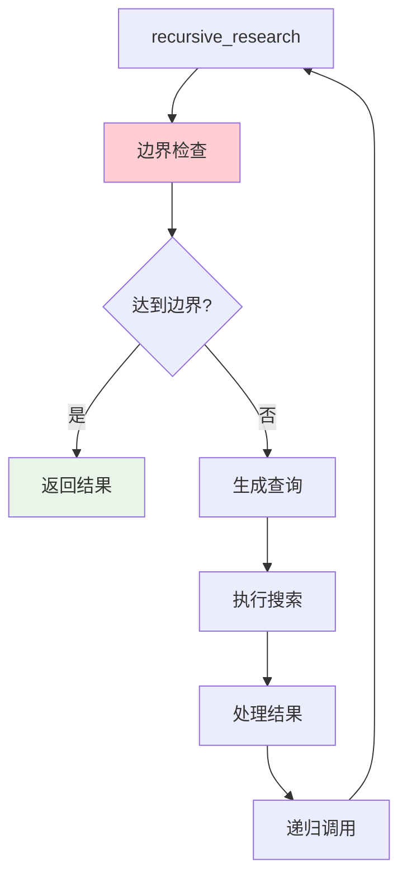
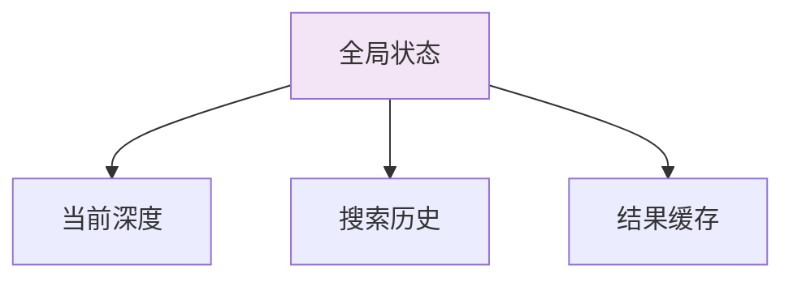
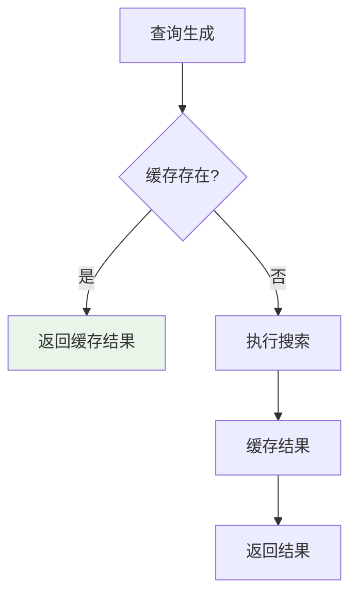
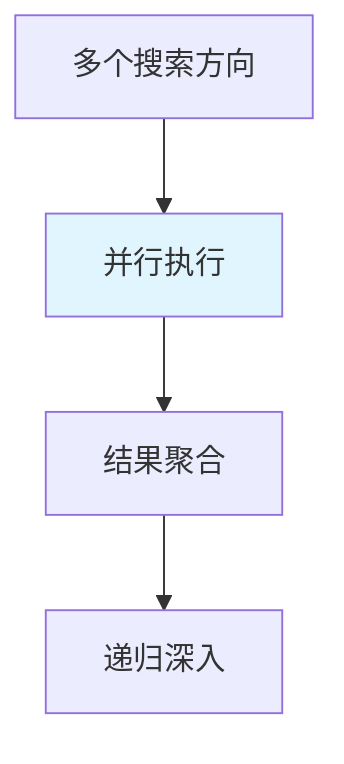
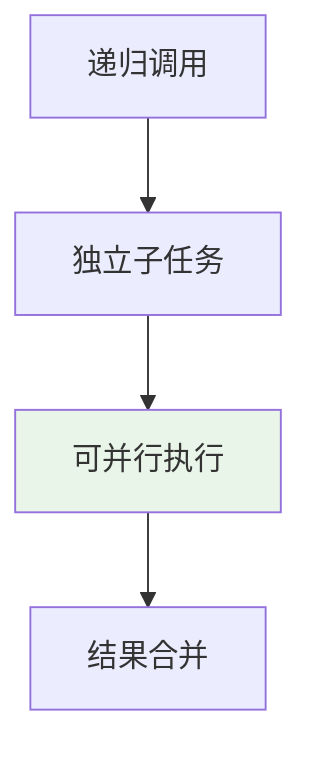
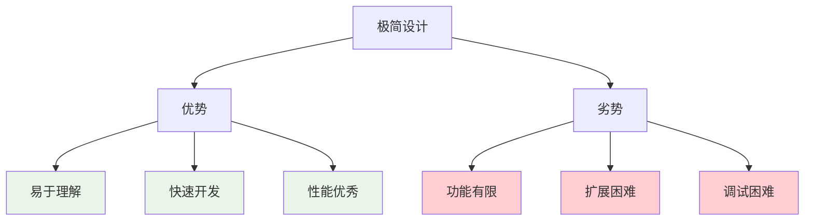

# 📚 第七章：递归设计模式

## 🧭 导航链接
- [📖 返回主目录](../RESEARCH_AGENT_LEARNING_MANUAL.md)
- [⬅️ 上一章：工作流分析](../phase-02-deepsearchagent-demo/chapter-06-workflow-analysis.md)
- [➡️ 下一章：性能优化](./chapter-08-performance-optimization.md)

## ⏰ 学习时间：45分钟

## 🎯 本章目标
- 深入理解递归架构的设计哲学和核心原理
- 掌握deep-research的递归控制机制
- 分析递归设计的优势和局限性
- 理解极简主义设计在Research Agent中的应用

---

## 🎯 第一部分：递归设计哲学（15分钟）

### 🎭 什么是递归架构？

递归架构是一种通过**自我调用**来实现深度探索的设计模式。在Research Agent中，递归架构体现为：

#### 核心思想
- **深度优先搜索**：沿着一个方向深入探索直到达到边界
- **自我调用**：用相同的逻辑处理不同层次的问题
- **边界控制**：通过明确的终止条件避免无限递归

#### 与传统对比


### 🧩 递归在Research Agent中的意义

#### 1. **自然的探索模式**
人类的深度研究过程本身就是递归的：
- 提出问题 → 寻找答案 → 发现新问题 → 继续深入
- 递归架构模拟了这种自然的认知过程

#### 2. **灵活的深度控制**
- 可以根据需要动态调整探索深度
- 不同主题可以有不同的研究深度
- 支持自适应的深度分配

#### 3. **简洁的实现逻辑**
- 用相同的代码处理不同层次
- 减少了复杂的状态管理
- 代码量大幅减少

### 🎯 deep-research的递归模型

#### 基本递归流程


#### 递归参数控制
- **深度参数（Depth）**：控制递归的最大层数
- **广度参数（Breadth）**：控制每层的搜索数量
- **质量阈值**：决定是否继续深入的判断标准

---

## 🏗️ 第二部分：递归控制机制（15分钟）

### 🎮 核心控制逻辑

#### 递归函数结构


#### 边界条件设计
```python
def should_continue_recursive(current_depth, max_depth, 
                            result_quality, min_quality):
    """递归终止条件判断"""
    
    # 深度边界
    if current_depth >= max_depth:
        return False
    
    # 质量边界
    if result_quality < min_quality:
        return False
    
    # 收益边界
    if marginal_benefit < threshold:
        return False
    
    return True
```

### 📊 递归状态管理

#### 最小化状态设计
deep-research采用极简的状态管理策略：



#### 状态传递机制
- **参数传递**：通过函数参数传递必要状态
- **返回值聚合**：通过返回值收集递归结果
- **全局缓存**：可选的全局结果缓存

### 🔄 递归优化策略

#### 1. **记忆化（Memoization）**


#### 2. **剪枝策略**
- **相关性剪枝**：过滤低相关性的搜索方向
- **重复性剪枝**：避免重复的搜索路径
- **收益剪枝**：停止低收益的深入探索

#### 3. **并行递归**


---

## ⚡ 第三部分：性能优势分析（10分钟）

### 🚀 为什么递归架构性能优秀？

#### 1. **最小化开销**
- **状态管理简单**：不需要复杂的状态对象
- **内存占用低**：只保存必要的递归栈信息
- **计算开销小**：避免了复杂的状态同步

#### 2. **天然的并发性**


#### 3. **缓存友好**
- **查询重复性高**：相似查询可能重复出现
- **结果可复用**：深层搜索的结果可以被浅层复用
- **局部性原理**：相关查询在时间和空间上聚集

### 📊 性能对比分析

| 性能维度 | 递归架构 | 节点化架构 | 企业级架构 |
|----------|----------|------------|------------|
| **内存占用** | 🟢 低 | 🟡 中等 | 🔴 高 |
| **执行速度** | 🟢 快 | 🟡 中等 | 🔴 较慢 |
| **并发能力** | 🟢 强 | 🟡 中等 | 🟡 中等 |
| **缓存效率** | 🟢 高 | 🟡 中等 | 🟢 高 |

### ⚡ 性能优化技巧

#### 1. **智能深度分配**
```python
def calculate_optimal_depth(topic_complexity, time_budget, 
                          quality_requirement):
    """动态计算最优递归深度"""
    
    base_depth = 3
    
    # 复杂度调整
    complexity_factor = topic_complexity / 10
    depth_adjustment = int(complexity_factor * 2)
    
    # 时间约束调整
    time_factor = time_budget / 60  # 分钟
    time_adjustment = int(time_factor)
    
    # 质量要求调整
    quality_factor = quality_requirement / 100
    quality_adjustment = int(quality_factor * 3)
    
    optimal_depth = base_depth + depth_adjustment + time_adjustment + quality_adjustment
    
    return min(optimal_depth, 10)  # 最大深度限制
```

#### 2. **结果预计算**
- 在低负载时预计算常见查询
- 建立分层缓存体系
- 实现智能预测和预加载

---

## 🎯 第四部分：极简主义设计分析（5分钟）

### 🎭 极简主义的设计哲学

#### 核心原则
1. **功能最小化**：只实现最核心的功能
2. **代码最小化**：保持<500行核心代码
3. **依赖最小化**：减少外部依赖
4. **配置最小化**：最少的配置参数

#### 设计权衡


### 📚 教学价值

#### 1. **概念清晰性**
- 递归概念的直接体现
- Research Agent核心逻辑的纯粹展示
- 复杂系统的简化模型

#### 2. **学习友好性**
- 代码量少，易于阅读和理解
- 核心逻辑突出，干扰信息少
- 适合作为算法和架构的学习案例

#### 3. **实验价值**
- 快速原型验证
- 算法效果测试
- 新想法的实验平台

### 💭 思考练习

1. **递归改进**：如何为deep-research添加更好的错误处理机制，同时保持其简洁性？

2. **性能优化**：在保持极简设计的前提下，还有哪些性能优化空间？

3. **扩展思考**：如果要为deep-research添加一个关键功能（如结果可视化），最小化的实现方式是什么？

---

## 📚 本章小结

### ✅ 核心要点

1. **递归架构通过深度优先搜索实现自然的研究探索模式**
2. **极简主义设计在性能和可理解性方面具有显著优势**
3. **递归控制机制需要在深度、质量和效率之间找到平衡**
4. **极简设计适合作为概念验证和学习工具**

### 🚀 下一步

在下一章中，我们将深入学习deep-research的性能优化策略，了解如何在保持简洁的同时实现高性能。

### 📖 延伸阅读

- 《递归算法设计与分析》
- 《极简主义编程哲学》
- 《高性能系统设计模式》

---

**⏰ 完成时间检查**：确保你在45分钟内完成了本章学习。重点理解递归设计的核心思想和实现机制。