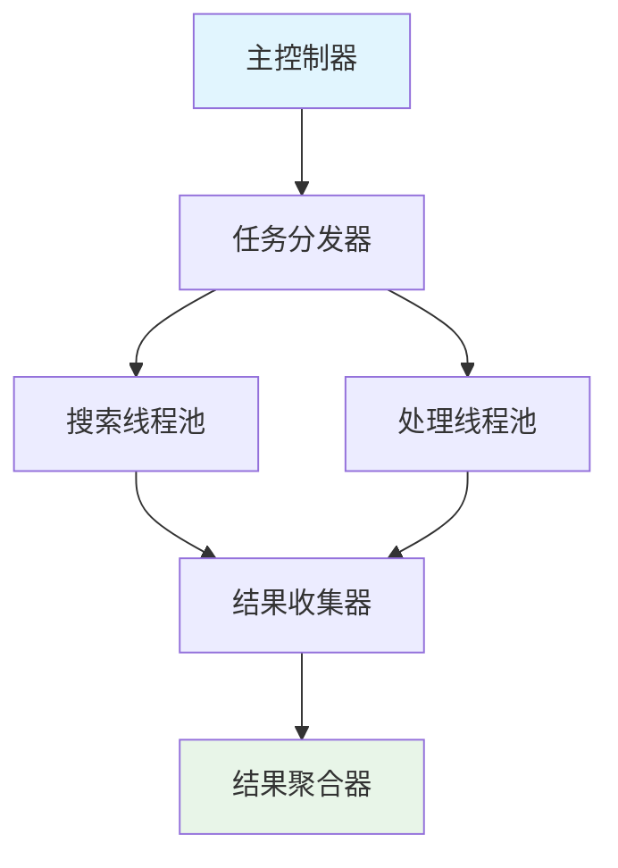
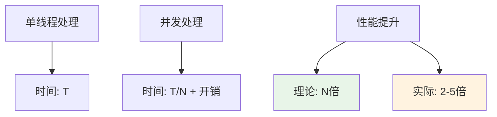
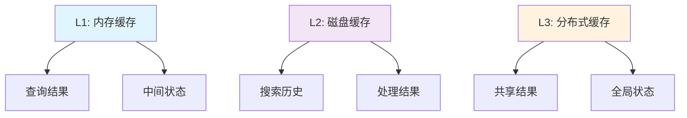
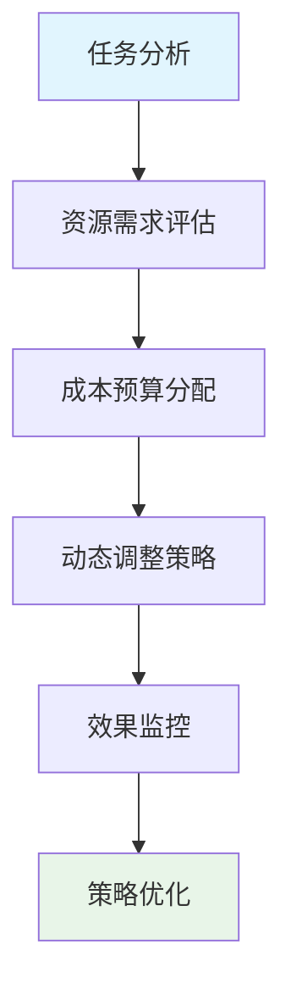
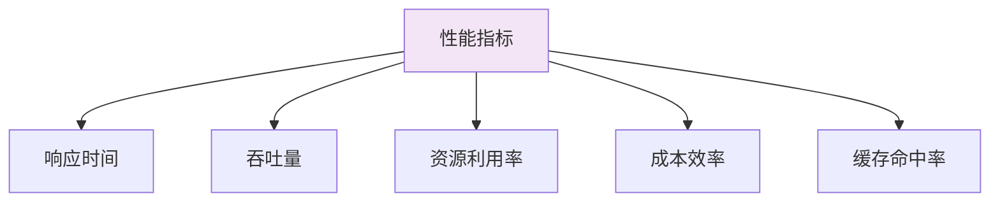
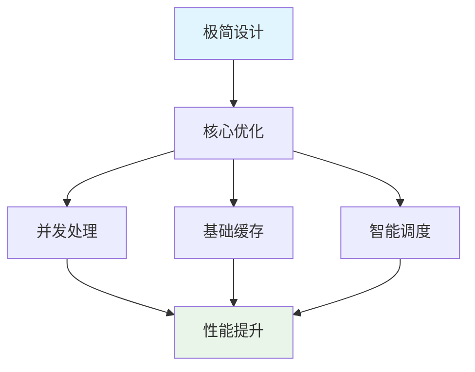

# 📚 第八章：性能优化策略

## 🧭 导航链接
- [📖 返回主目录](../RESEARCH_AGENT_LEARNING_MANUAL.md)
- [⬅️ 上一章：递归设计模式](./chapter-07-recursive-design.md)
- [➡️ 下一章：极简主义方法](./chapter-09-minimalist-approach.md)

## ⏰ 学习时间：45分钟

## 🎯 本章目标
- 深入理解deep-research的性能优化策略
- 掌握并发处理和缓存机制的设计
- 分析资源管理和成本控制方法
- 理解极简架构下的性能权衡

---

## ⚡ 第一部分：并发处理架构（15分钟）

### 🎯 并发设计的核心价值

在Research Agent中，并发处理是提升性能的关键策略：

#### 1. **搜索并发化**
- 同时执行多个搜索查询
- 减少总体等待时间
- 提高资源利用率

#### 2. **处理流水线**
- 搜索和处理并行进行
- 避免CPU空闲等待
- 提升整体吞吐量

#### 3. **递归并行化**
- 不同分支的递归可以并行
- 充分利用多核资源
- 加速深度探索过程

### 🏗️ 并发架构设计

#### 基本并发模型


#### 并发控制策略
```python
async def concurrent_search(queries, max_concurrent=5):
    """并发搜索实现"""
    
    semaphore = asyncio.Semaphore(max_concurrent)
    
    async def search_with_limit(query):
        async with semaphore:
            return await execute_search(query)
    
    tasks = [search_with_limit(q) for q in queries]
    results = await asyncio.gather(*tasks)
    
    return results
```

### 📊 并发性能分析

#### 性能提升模型


#### 并发挑战
- **资源竞争**：过多并发导致资源争抢
- **网络限制**：API调用频率限制
- **内存压力**：并发结果占用大量内存
- **错误处理**：并发环境下的异常处理复杂度

---

## 💾 第二部分：缓存机制设计（15分钟）

### 🎯 缓存策略的重要性

在Research Agent中，缓存机制是性能优化的核心：

#### 1. **查询缓存**
- 避免重复的搜索请求
- 减少API调用成本
- 提升响应速度

#### 2. **结果缓存**
- 保存搜索结果供后续使用
- 支持离线模式
- 便于结果分析和复用

#### 3. **中间结果缓存**
- 缓存递归中间状态
- 支持断点续传
- 减少重复计算

### 🏗️ 多层缓存架构

#### 缓存层次设计


#### 缓存实现策略
```python
class ResearchCache:
    def __init__(self):
        self.memory_cache = {}      # L1缓存
        self.disk_cache = {}        # L2缓存
        self.cache_stats = {
            'hits': 0,
            'misses': 0,
            'evictions': 0
        }
    
    async def get(self, key):
        # L1缓存查找
        if key in self.memory_cache:
            self.cache_stats['hits'] += 1
            return self.memory_cache[key]
        
        # L2缓存查找
        if key in self.disk_cache:
            value = await self.load_from_disk(key)
            self.memory_cache[key] = value  # 提升到L1
            self.cache_stats['hits'] += 1
            return value
        
        self.cache_stats['misses'] += 1
        return None
```

### 🔄 缓存优化策略

#### 1. **智能过期机制**
```python
def should_evict(cache_entry, current_time):
    """智能缓存过期判断"""
    
    # 时间过期
    age = current_time - cache_entry.created_time
    if age > MAX_AGE:
        return True
    
    # 访问频率过期
    if cache_entry.access_count < MIN_ACCESS_COUNT:
        if age > FREQUENCY_BASED_EXPIRE:
            return True
    
    # 相关性过期
    if cache_entry.relevance_score < MIN_RELEVANCE:
        return True
    
    return False
```

#### 2. **预加载策略**
- 基于历史访问模式预加载
- 在低负载时主动预计算
- 智能预测用户需求

#### 3. **压缩存储**
- 对大结果进行压缩存储
- 分层存储不同重要性的数据
- 定期清理低价值缓存

---

## 💰 第三部分：资源管理和成本控制（10分钟）

### 🎯 成本控制的重要性

Research Agent的运行涉及多种资源成本：

#### 1. **API调用成本**
- 搜索API费用
- LLM API费用
- 第三方服务费用

#### 2. **计算资源成本**
- CPU使用时间
- 内存占用
- 网络带宽

#### 3. **存储成本**
- 缓存存储空间
- 结果持久化
- 日志存储

### 📊 成本优化策略

#### 智能资源分配


#### 成本控制机制
```python
class CostController:
    def __init__(self, budget_limit):
        self.budget_limit = budget_limit
        self.current_spend = 0
        self.cost_history = []
    
    def can_afford(self, operation_cost):
        """检查是否可以承担操作成本"""
        return (self.current_spend + operation_cost) <= self.budget_limit
    
    def optimize_operation(self, operation):
        """优化操作以降低成本"""
        
        # 检查缓存
        cached_result = self.cache.get(operation.hash)
        if cached_result:
            return cached_result  # 零成本
        
        # 选择 cheaper 的模型
        if operation.complexity < threshold:
            operation.model = "cheaper_model"
        
        # 减少搜索深度
        if self.current_spend > self.budget_limit * 0.8:
            operation.max_depth = min(operation.max_depth, 2)
        
        return operation
```

### 📈 性能监控和分析

#### 关键性能指标


#### 实时监控机制
- 延迟监控：每个操作的执行时间
- 吞吐量监控：单位时间处理的任务数
- 错误率监控：失败操作的统计和分析
- 成本监控：实时成本跟踪和预警

---

## 🎯 第四部分：极简架构的性能权衡（5分钟）

### 🎭 极简设计的性能影响

#### 性能优势
1. **低开销**：最少的系统开销和资源占用
2. **高效率**：直接的执行路径，无额外抽象层
3. **快启动**：初始化时间短，响应迅速
4. **易调试**：问题定位快速，性能瓶颈明显

#### 性能局限
1. **功能有限**：缺少高级优化特性
2. **扩展困难**：性能优化空间受限
3. **并发简单**：并发控制机制较为基础
4. **缓存简单**：缓存策略相对简单

### 💡 优化平衡点

#### 保持简洁的优化策略


#### 避免过度复杂化
- 保持核心逻辑的简洁性
- 只添加必要的优化功能
- 优先考虑可维护性
- 平衡性能和代码质量

### 💭 思考练习

1. **成本优化**：在有限的预算下，如何优化deep-research的研究质量？

2. **缓存设计**：为deep-research设计一个更智能的缓存系统，但保持其简洁性。

3. **并发改进**：如何改进并发处理机制以提升性能，同时不增加太多复杂度？

---

## 📚 本章小结

### ✅ 核心要点

1. **并发处理是deep-research性能优化的核心策略**
2. **多层缓存机制显著提升了系统响应速度**
3. **成本控制需要在性能和质量之间找到平衡**
4. **极简架构在性能优化中需要保持设计的简洁性**

### 🚀 下一步

在下一章中，我们将分析deep-research的极简主义方法，理解这种设计哲学的价值和应用场景。

### 📖 延伸阅读

- 《高性能并发编程实践》
- 《缓存系统设计与实现》
- 《成本敏感的系统优化》

---

**⏰ 完成时间检查**：确保你在45分钟内完成了本章学习。重点理解性能优化的策略和实现方法。