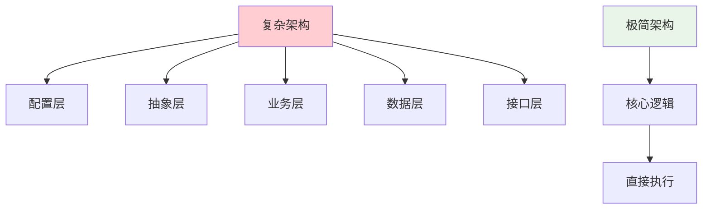
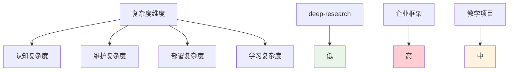
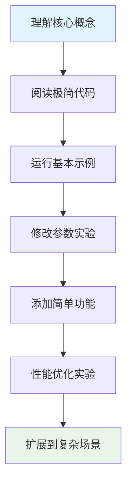

# 📚 第九章：deep-research 极简主义方法

## 🧭 导航链接
- [📖 返回主目录](../RESEARCH_AGENT_LEARNING_MANUAL.md)
- [⬅️ 上一章：性能优化策略](./chapter-08-performance-optimization.md)
- [➡️ 下一章：企业级架构](../phase-02-claude-agent-sdk/chapter-10-enterprise-architecture.md)

## ⏰ 学习时间：45分钟

## 🎯 本章目标
- 深入理解极简主义设计哲学的核心价值
- 掌握"少即是多"的设计原则在Research Agent中的应用
- 分析极简设计的优势和适用场景
- 理解如何在简洁性和功能性之间找到平衡

---

## 🎯 第一部分：极简主义设计哲学（15分钟）

### 🎭 什么是极简主义设计？

极简主义设计是一种"**少即是多**"的设计哲学，强调：

#### 核心原则
1. **功能精简**：只保留最核心、最必要的功能
2. **代码简洁**：用最少的代码实现核心功能
3. **依赖最小**：减少外部依赖，降低系统复杂度
4. **接口简单**：提供清晰、直观的使用接口

#### 设计目标
- **可理解性**：代码和逻辑易于理解和学习
- **可维护性**：简单的结构便于维护和修改
- **可扩展性**：为未来的扩展预留空间
- **高性能**：减少不必要的开销

### 🧩 极简主义在软件中的体现

#### 代码层面的极简
```python
# 复杂的实现
class ComplexResearchAgent:
    def __init__(self):
        self.config_manager = ConfigurationManager()
        self.state_manager = StateManager()
        self.node_factory = NodeFactory()
        self.tool_registry = ToolRegistry()
        # ... 更多组件
    
    def research(self, query):
        # 复杂的流程控制
        pass

# 极简的实现
def deep_research(topic, depth=3, breadth=5):
    """极简的研究函数"""
    results = []
    
    def recursive_search(current_topic, current_depth):
        if current_depth <= 0:
            return
        
        queries = generate_queries(current_topic, breadth)
        for query in queries:
            result = search(query)
            results.append(result)
            recursive_search(result.next_topic, current_depth - 1)
    
    recursive_search(topic, depth)
    return synthesize_results(results)
```

#### 架构层面的极简


---

## 📊 第二部分：deep-research的极简实现分析（15分钟）

### 🎯 核心代码结构分析

#### 文件结构极简
```
deep-research/
├── index.js          # 主入口文件
├── package.json      # 依赖配置
└── README.md         # 项目文档
```

#### 核心函数极简
```javascript
// 核心研究函数（约50行）
async function deepResearch(topic, options = {}) {
    const { depth = 2, breadth = 4, model = 'o3-mini' } = options;
    
    let results = [];
    let currentQueries = [topic];
    
    for (let currentDepth = 0; currentDepth < depth; currentDepth++) {
        const searchResults = await Promise.all(
            currentQueries.map(query => searchAndProcess(query, model))
        );
        
        results = results.concat(searchResults);
        currentQueries = extractNextQueries(searchResults, breadth);
    }
    
    return generateReport(results);
}
```

### 🔧 功能极简化的策略

#### 1. **功能聚焦**
- 只保留核心的研究功能
- 去除管理、监控、配置等辅助功能
- 专注于搜索→处理→递归的核心循环

#### 2. **参数简化**
```javascript
// 复杂的参数配置
const complexConfig = {
    search: {
        provider: 'tavily',
        maxResults: 10,
        timeout: 30000,
        retryCount: 3,
        filters: ['news', 'academic', 'web']
    },
    llm: {
        provider: 'openai',
        model: 'gpt-4',
        temperature: 0.1,
        maxTokens: 2000,
        systemPrompt: '...'
    },
    recursion: {
        maxDepth: 5,
        breadthControl: 'adaptive',
        qualityThreshold: 0.7
    }
};

// 极简的参数配置
function deepResearch(topic, depth = 2, breadth = 4) {
    // 所有配置都有合理的默认值
}
```

#### 3. **依赖最小化**
```json
{
  "dependencies": {
    "openai": "^4.0.0",
    "tavily": "^1.0.0"
  },
  "devDependencies": {
    "node": ">=18"
  }
}
```

### 📈 极简设计的量化分析

#### 代码量对比
| 项目类型 | 代码行数 | 文件数量 | 主要功能 |
|----------|----------|----------|----------|
| **deep-research** | < 500行 | 3个文件 | 核心研究 |
| **企业级框架** | > 10000行 | 50+文件 | 完整功能 |
| **教学项目** | 2000行 | 20个文件 | 平衡功能 |

#### 复杂度指标


---

## 🎓 第三部分：极简主义的教学价值（10分钟）

### 🎯 为什么极简设计适合教学？

#### 1. **概念聚焦**
- 去除干扰信息，突出核心概念
- 便于理解Research Agent的本质
- 降低学习门槛

#### 2. **代码可读性**
```javascript
// 清晰的核心逻辑
async function researchLoop(topic, depth) {
    if (depth === 0) return [];
    
    const results = await search(topic);
    const summaries = await summarize(results);
    const nextTopics = extractTopics(summaries);
    
    const deepResults = [];
    for (const nextTopic of nextTopics) {
        deepResults.push(...await researchLoop(nextTopic, depth - 1));
    }
    
    return combine(results, deepResults);
}
```

#### 3. **渐进式学习**
- 从简单开始，逐步添加功能
- 每个改进都有明确的价值
- 便于实验和验证

### 📚 教学应用场景

#### 🎓 学术教学
- **算法课程**：递归算法的实际应用
- **软件架构**：简洁设计的价值体现
- **人工智能**：Research Agent的核心概念

#### 🧪 实验教学
- **算法对比**：不同搜索策略的效果对比
- **性能分析**：简洁架构的性能特征
- **扩展实验**：在极简基础上添加功能

#### 🔬 研究探索
- **新算法验证**：快速验证新想法
- **性能优化**：优化策略的效果测试
- **用户体验**：简洁界面的用户研究

### 🎯 学习路径设计

#### 渐进式学习计划


---

## 🎭 第四部分：极简与复杂的平衡（5分钟）

### ⚖️ 设计权衡分析

#### 极简的优势
✅ **学习成本低**：快速理解和上手  
✅ **维护简单**：bug定位和修复容易  
✅ **部署方便**：最少的依赖和配置  
✅ **性能优秀**：直接的执行路径  

#### 极简的局限
❌ **功能有限**：缺少高级特性  
❌ **扩展困难**：架构限制了扩展性  
❌ **错误处理简陋**：缺乏完善的错误机制  
❌ **生产就绪性差**：缺少企业级特性  

### 🔄 平衡策略

#### 何时选择极简
- 🎓 **学习和教学**场景
- 🧪 **快速原型**验证
- 💡 **概念验证**项目
- 📊 **算法研究**平台

#### 何时需要复杂
- 🏢 **生产环境**部署
- 🔒 **安全要求**严格
- 🔧 **功能需求**复杂
- 📈 **长期维护**项目

### 💭 思考练习

1. **设计决策**：在什么情况下你会选择极简设计而不是复杂设计？

2. **功能扩展**：如何在保持deep-research简洁性的同时，添加一个关键功能？

3. **教学改进**：如果你要用deep-research教学，会如何设计学习路径和实验？

---

## 📚 本章小结

### ✅ 核心要点

1. **极简主义设计通过"少即是多"的理念实现核心价值**
2. **deep-research展示了极简设计在Research Agent中的成功应用**
3. **极简设计具有显著的教学价值和快速原型能力**
4. **需要在简洁性和功能性之间找到合适的平衡点**

### 🚀 下一步

在下一阶段中，我们将学习Claude Agent SDK的企业级架构，看看与极简设计完全不同的设计哲学。

### 📖 延伸阅读

- 《极简主义编程哲学》
- 《软件设计的艺术》
- 《教育软件设计原则》

---

**⏰ 完成时间检查**：确保你在45分钟内完成了本章学习。重点理解极简主义设计的价值和应用场景。