# 📚 第四章：节点式架构设计

## 🧭 导航链接
- [📖 返回主目录](../RESEARCH_AGENT_LEARNING_MANUAL.md)
- [⬅️ 上一章：三个项目概览](../phase-01-fundamentals/chapter-03-three-projects-overview.md)
- [➡️ 下一章：状态管理](./chapter-05-state-management.md)

## ⏰ 学习时间：45分钟

## 🎯 本章目标
- 深入理解节点化架构的设计原理和优势
- 掌握DeepSearchAgent-Demo的六大核心节点
- 理解节点间的协作机制和数据流
- 分析节点化架构的教学价值和局限性

---

## 🏗️ 第一部分：节点化架构设计原理（15分钟）

### 🎯 核心设计思想

节点化架构基于**流水线模式**（Pipeline Pattern），将复杂的Research Agent流程分解为一系列专门的处理节点。这种设计的核心思想是：

#### 1. **单一职责原则**
- 每个节点专注于一个特定的功能
- 清晰的输入输出接口定义
- 降低系统的复杂度和认知负担

#### 2. **状态驱动执行**
- 中央状态管理器协调节点执行
- 节点间通过状态对象传递信息
- 支持执行的中断和恢复

#### 3. **可预测的执行流程**
- 线性的节点执行顺序
- 明确的处理步骤和阶段
- 便于调试和问题定位

### 🧩 架构层次图

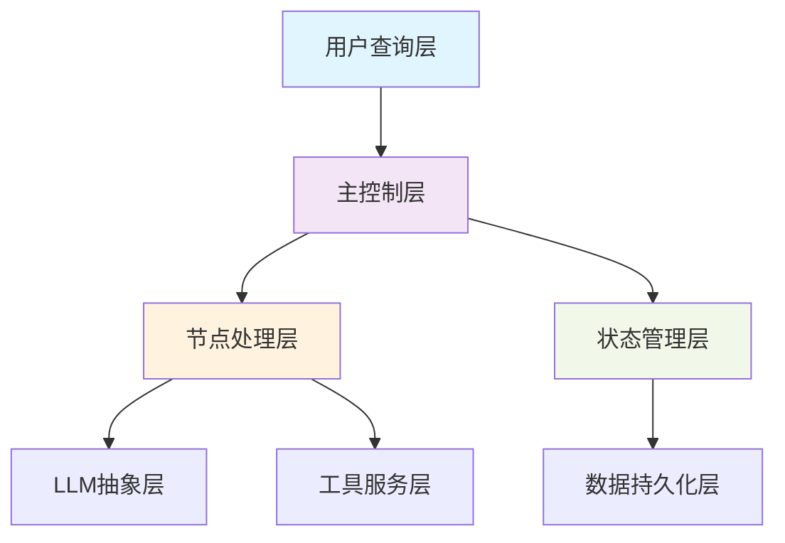

### 🔄 节点执行模式

#### 顺序执行模式
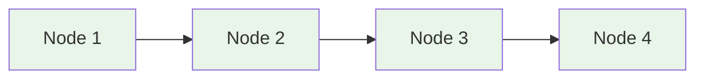

#### 条件分支模式
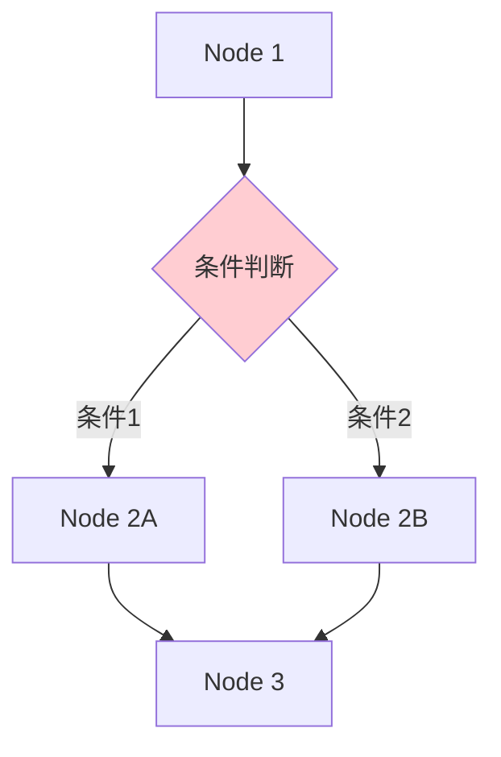

#### 循环迭代模式
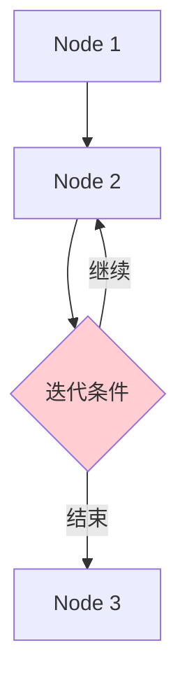

---

## 🎭 第二部分：六大核心节点详解（15分钟）

### 📋 节点概览

DeepSearchAgent-Demo包含六个核心处理节点，每个节点都有明确的职责和功能：

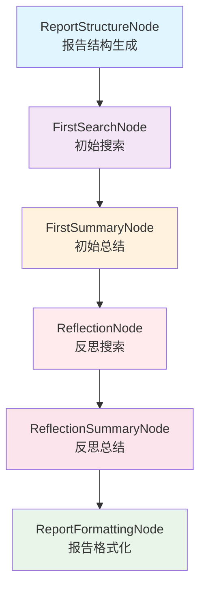

### 🏗️ 节点1：ReportStructureNode（报告结构生成）

#### 🎯 核心职责
- 分析用户查询意图
- 生成研究报告的大纲结构
- 确定段落的标题和内容规划

#### 🔄 工作机制
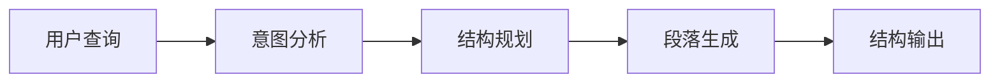

#### 📝 关键输入输出
- **输入**：用户原始查询字符串
- **输出**：结构化的段落列表（标题+内容描述）

#### 💡 设计价值
- 为后续处理提供清晰的结构指导
- 确保报告的逻辑性和完整性
- 便于用户理解和修改研究方向

### 🔍 节点2：FirstSearchNode（初始搜索）

#### 🎯 核心职责
- 根据段落内容生成搜索查询
- 执行网络搜索获取相关信息
- 评估搜索结果的相关性

#### 🔄 工作机制
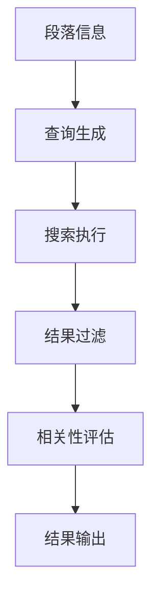

#### 📝 关键输入输出
- **输入**：段落标题和内容描述
- **输出**：搜索查询字符串和搜索结果列表

#### 💡 设计价值
- 将抽象的研究需求转化为具体的搜索查询
- 提供多样化的信息来源
- 为后续总结提供原始材料

### 📄 节点3：FirstSummaryNode（初始总结）

#### 🎯 核心职责
- 分析和整合搜索结果
- 生成段落的初始内容
- 提取关键信息和观点

#### 🔄 工作机制
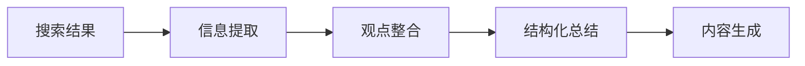

#### 📝 关键输入输出
- **输入**：段落信息和搜索结果
- **输出**：结构化的段落内容

#### 💡 设计价值
- 将碎片化的搜索信息转化为连贯的内容
- 建立段落的基本观点和论证
- 为后续反思提供基础材料

### 🤔 节点4：ReflectionNode（反思搜索）

#### 🎯 核心职责
- 分析当前内容的不足和遗漏
- 生成针对性的补充搜索查询
- 发现新的研究角度和深度

#### 🔄 工作机制
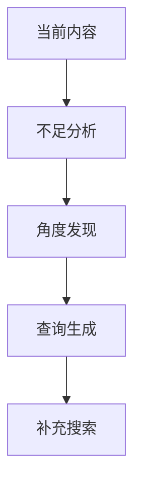

#### 📝 关键输入输出
- **输入**：当前段落内容和研究状态
- **输出**：反思搜索查询和推理过程

#### 💡 设计价值
- 实现研究的深度和广度扩展
- 避免信息遗漏和偏见
- 提升研究报告的质量和完整性

### 🔄 节点5：ReflectionSummaryNode（反思总结）

#### 🎯 核心职责
- 整合原始内容和补充信息
- 优化和完善段落内容
- 确保逻辑的一致性和连贯性

#### 🔄 工作机制
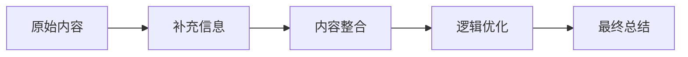

#### 📝 关键输入输出
- **输入**：原始内容、补充搜索结果、反思推理
- **输出**：更新后的段落内容

#### 💡 设计价值
- 实现信息的深度整合
- 提升内容的质量和准确性
- 为最终报告做好准备

### 🎨 节点6：ReportFormattingNode（报告格式化）

#### 🎯 核心职责
- 整合所有段落内容
- 应用格式化和样式
- 生成最终的Markdown报告

#### 🔄 工作机制
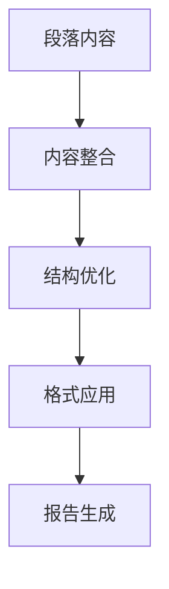

#### 📝 关键输入输出
- **输入**：所有段落的最终内容
- **输出**：完整的Markdown格式报告

#### 💡 设计价值
- 提供专业和美观的报告格式
- 确保报告的可读性和实用性
- 完成整个研究流程的闭环

---

## 🔧 第三部分：节点协作机制（10分钟）

### 🎯 协作模式分析

#### 1. **数据流协作**
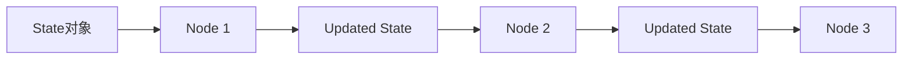

#### 2. **状态共享机制**
- **中央状态管理**：所有节点共享同一个State对象
- **增量更新**：每个节点只更新自己负责的部分
- **状态持久化**：支持状态的中断保存和恢复

#### 3. **错误处理协作**
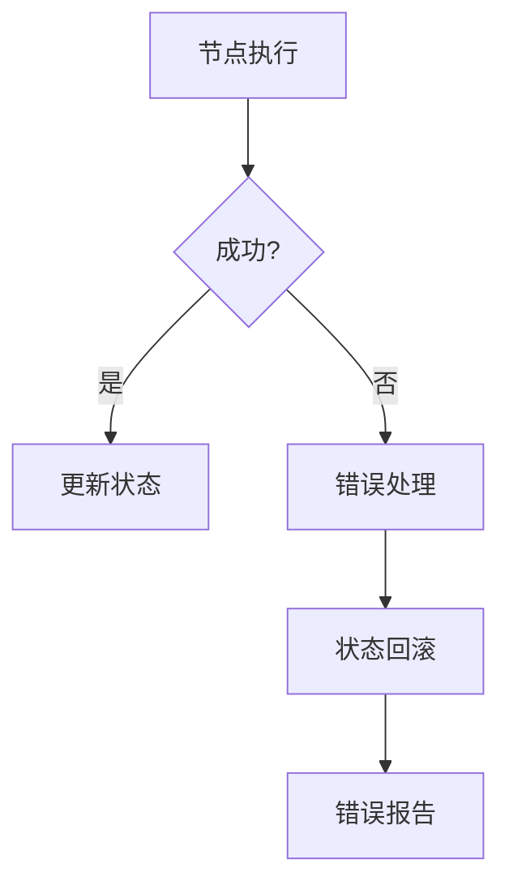

### 🔄 节点间的依赖关系

#### 顺序依赖
- ReportStructureNode → FirstSearchNode
- FirstSearchNode → FirstSummaryNode
- FirstSummaryNode → ReflectionNode

#### 循环依赖
- ReflectionNode → ReflectionSummaryNode → ReflectionNode
（可配置的反思循环次数）

#### 聚合依赖
- 所有段落节点 → ReportFormattingNode

### 📊 性能和可扩展性考虑

#### 性能优化策略
- **节点并行**：不同段落可以并行处理
- **状态缓存**：避免重复的LLM调用
- **结果复用**：相似查询的结果复用

#### 扩展性设计
- **节点接口标准化**：便于添加新节点
- **配置驱动**：通过配置调整节点行为
- **插件化架构**：支持第三方节点扩展

---

## 🎓 第四部分：教学价值分析（5分钟）

### 🎯 为什么节点化架构适合教学？

#### 1. **概念清晰性**
- 每个Research Agent的核心概念都有对应的节点
- 便于理解抽象概念的具体实现
- 降低认知复杂度

#### 2. **可视化友好**
- 节点流程图直观易懂
- 便于绘制和讲解架构
- 支持交互式演示

#### 3. **渐进式学习**
- 可以逐个节点学习和理解
- 便于模块化的教学设计
- 支持不同深度的学习需求

### 📚 教学应用场景

#### 🎓 学术教学
- AI课程的Research Agent章节
- 软件架构设计的教学案例
- 系统设计思维培养

#### 🧪 实验教学
- 节点功能的独立实验
- 节点间协作的观察实验
- 性能和效果的对比实验

#### 🔬 研究探索
- 新节点算法的研究平台
- 不同节点组合的效果对比
- Research Agent优化策略研究

### 💭 思考练习

1. **节点设计**：如果要为DeepSearchAgent-Demo添加一个新的"数据验证"节点，应该放在哪个位置？它的职责是什么？

2. **架构改进**：节点化架构的主要局限性是什么？如何改进？

3. **教学应用**：如果你要用这个项目教学，会如何设计课程大纲？

---

## 📚 本章小结

### ✅ 核心要点

1. **节点化架构通过职责分离简化了复杂的Research Agent流程**
2. **六大核心节点覆盖了研究报告生成的完整生命周期**
3. **状态驱动的协作机制确保了节点间的有效配合**
4. **节点化架构具有显著的教学价值和可理解性优势**

### 🚀 下一步

在下一章中，我们将深入学习DeepSearchAgent-Demo的状态管理系统，这是节点化架构的核心支撑机制。

### 📖 延伸阅读

- 《流水线模式在AI系统中的应用》
- 《状态管理设计模式》
- 《教育软件的架构设计原则》

---

**⏰ 完成时间检查**：确保你在45分钟内完成了本章学习。重点理解节点化架构的设计思想和协作机制。