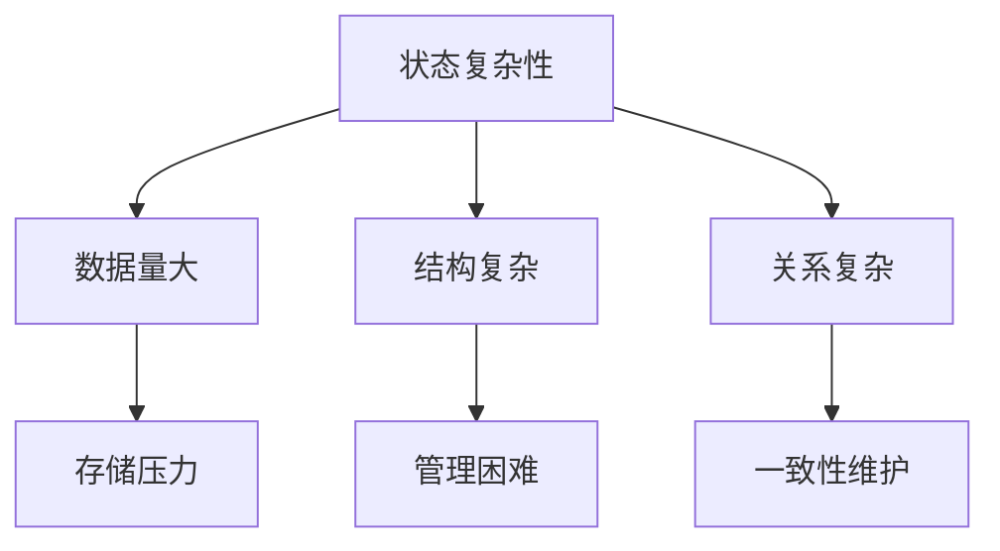
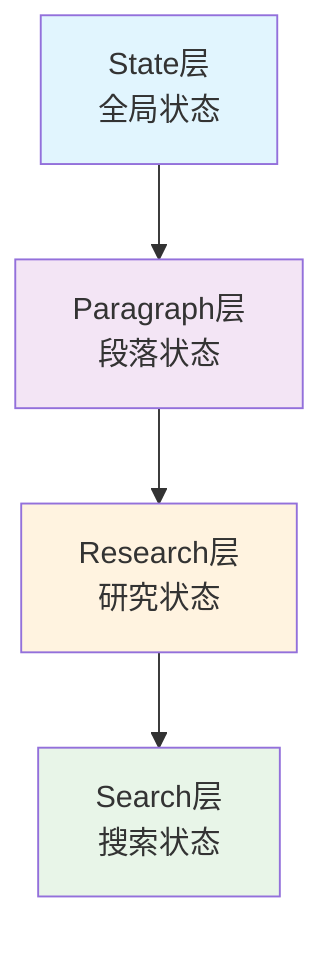
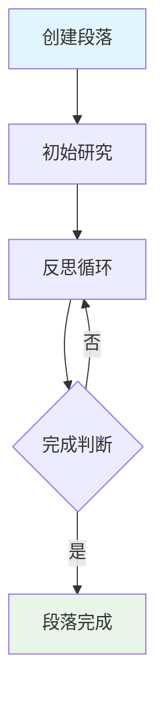
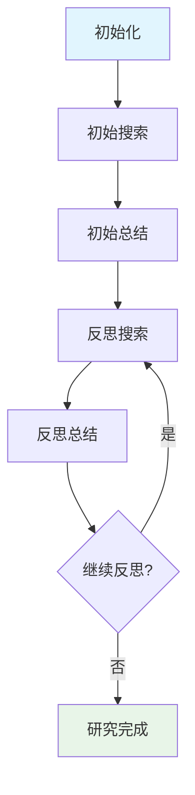
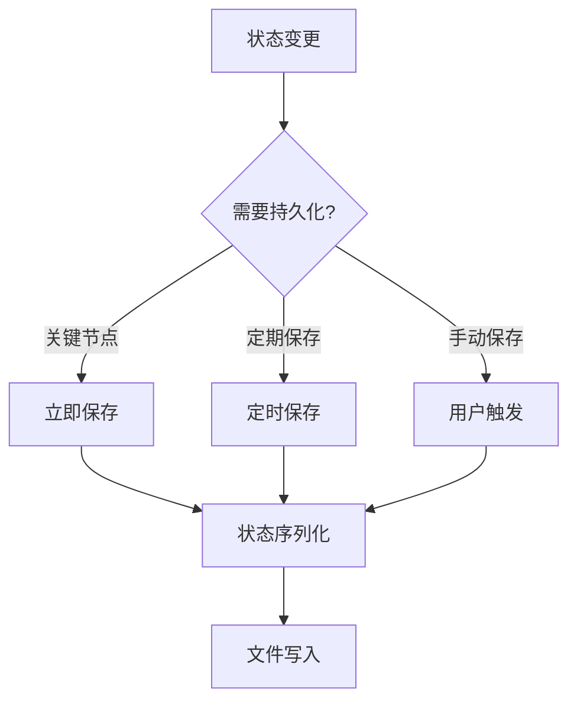
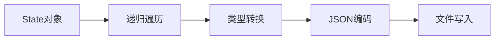
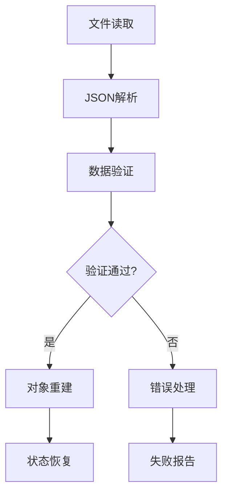

# 📚 第五章：状态管理系统

## 🧭 导航链接
- [📖 返回主目录](../RESEARCH_AGENT_LEARNING_MANUAL.md)
- [⬅️ 上一章：节点式架构设计](./chapter-04-node-based-architecture.md)
- [➡️ 下一章：工作流分析](./chapter-06-workflow-analysis.md)

## ⏰ 学习时间：45分钟

## 🎯 本章目标
- 深入理解Research Agent中状态管理的重要性
- 掌握DeepSearchAgent-Demo的分层状态设计
- 理解状态持久化和恢复机制
- 分析状态管理对系统可靠性的影响

---

## 🏗️ 第一部分：状态管理的核心价值（15分钟）

### 🎯 为什么状态管理如此重要？

在Research Agent中，状态管理是整个系统的"记忆中枢"，它承担着以下关键职责：

#### 1. **上下文连续性**
- 保持多轮对话的上下文信息
- 维护研究任务的进度和状态
- 确保决策的一致性和连贯性

#### 2. **中断恢复能力**
- 支持长时间运行任务的中断保存
- 实现系统崩溃后的状态恢复
- 提供任务的暂停和继续功能

#### 3. **调试和监控**
- 记录完整的执行历史
- 提供问题诊断的线索
- 支持性能分析和优化

#### 4. **协作支持**
- 多个组件间的信息共享
- 并发处理的同步机制
- 分布式系统的状态一致性

### 🧩 状态管理的挑战

#### 复杂性挑战


#### 性能挑战
- **内存占用**：大量状态数据的内存管理
- **序列化开销**：状态保存和恢复的时间成本
- **并发访问**：多线程环境下的状态同步

#### 可靠性挑战
- **数据一致性**：确保状态的完整性和正确性
- **故障恢复**：处理各种异常情况下的状态恢复
- **版本兼容**：状态格式的向前兼容性

---

## 📊 第二部分：DeepSearchAgent-Demo 状态架构（15分钟）

### 🏗️ 分层状态设计

DeepSearchAgent-Demo采用了四层状态架构，每一层都有明确的职责和边界：



### 🎯 State层：全局状态管理

#### 核心职责
- 管理整个研究任务的全局信息
- 协调各个段落的研究进度
- 提供系统级别的状态接口

#### 关键属性分析
```python
@dataclass
class State:
    query: str = ""                    # 🎯 原始查询
    report_title: str = ""             # 📋 报告标题
    paragraphs: List[Paragraph] = []   # 📝 段落列表
    final_report: str = ""             # 📄 最终报告
    is_completed: bool = False         # ✅ 完成状态
    created_at: str = ""               # ⏰ 创建时间
    updated_at: str = ""               # 🔄 更新时间
```

#### 设计价值分析
- **查询保持**：确保整个研究过程不偏离原始目标
- **进度跟踪**：通过段落列表跟踪整体进度
- **结果管理**：统一的报告生成和存储
- **时间戳管理**：支持审计和性能分析

### 📝 Paragraph层：段落状态管理

#### 核心职责
- 管理单个段落的研究状态
- 维护段落的基本信息和内容
- 协调段落内各个研究阶段

#### 关键属性分析
```python
@dataclass
class Paragraph:
    title: str = ""                    # 🏷️ 段落标题
    content: str = ""                  # 📄 段落内容
    research: Research = Research()    # 🔬 研究状态
    order: int = 0                     # 📊 段落顺序
```

#### 段落生命周期


### 🔬 Research层：研究状态管理

#### 核心职责
- 管理段落的研究过程
- 跟踪搜索和总结的迭代
- 维护研究的中间结果

#### 关键属性分析
```python
@dataclass
class Research:
    search_history: List[Search] = []    # 📚 搜索历史
    latest_summary: str = ""            # 📋 最新总结
    reflection_iteration: int = 0       # 🔄 反思次数
    is_completed: bool = False          # ✅ 完成状态
```

#### 研究过程状态机


### 🔍 Search层：搜索状态管理

#### 核心职责
- 记录单个搜索的详细信息
- 保存搜索结果和元数据
- 支持结果的追溯和分析

#### 关键属性分析
```python
@dataclass
class Search:
    query: str = ""                    # 🔍 搜索查询
    url: str = ""                      # 🔗 结果链接
    title: str = ""                    # 📋 结果标题
    content: str = ""                  # 📄 搜索内容
    score: Optional[float] = None      # 📊 相关度评分
    timestamp: str = ""                # ⏰ 搜索时间
```

---

## 🔄 第三部分：状态持久化和恢复（10分钟）

### 💾 持久化策略

#### 触发机制


#### 保存策略分析
- **关键节点保存**：段落完成、报告生成等重要节点
- **定期自动保存**：防止长时间运行时的数据丢失
- **手动保存**：用户主动触发的保存操作

### 🔄 序列化机制

#### JSON序列化流程


#### 序列化挑战和解决方案
| 挑战 | 解决方案 |
|------|----------|
| **复杂对象** | 分层序列化，逐层转换 |
| **循环引用** | 弱引用处理，避免死循环 |
| **类型信息** | 类型注解，反序列化时恢复 |
| **大文件处理** | 压缩存储，增量更新 |

### 🔄 恢复机制

#### 恢复流程设计


#### 恢复策略
- **完整恢复**：从完整状态文件恢复
- **增量恢复**：基于检查点的增量恢复
- **部分恢复**：只恢复特定组件的状态

### 🛡️ 可靠性保障

#### 数据完整性检查
```python
def validate_state(state: State) -> bool:
    """状态完整性验证"""
    checks = [
        len(state.query) > 0,           # 查询非空
        len(state.paragraphs) > 0,      # 段落存在
        all(p.title for p in state.paragraphs)  # 段落标题完整
    ]
    return all(checks)
```

#### 错误恢复机制
- **备份策略**：多版本备份，防止数据损坏
- **回滚机制**：检测到错误时自动回滚到上一个稳定状态
- **修复策略**：自动修复轻微的数据不一致问题

---

## 🎯 第四部分：状态管理的教学价值（5分钟）

### 🎓 为什么状态管理是重要的学习内容？

#### 1. **系统设计思维**
- 理解复杂系统的状态管理需求
- 学习分层设计的原则和方法
- 掌握数据结构的设计技巧

#### 2. **可靠性工程**
- 了解系统可靠性的重要性
- 学习故障恢复的设计模式
- 掌握数据一致性的保障机制

#### 3. **性能优化意识**
- 理解状态管理对系统性能的影响
- 学习存储和计算的权衡策略
- 掌握缓存和优化的基本方法

### 📚 教学应用场景

#### 🎓 概念教学
- **状态机理论**：通过具体实例理解状态机概念
- **数据结构设计**：学习复杂数据结构的设计方法
- **软件架构**：理解分层架构的设计思想

#### 🔬 实验教学
- **状态模拟实验**：观察状态变化对系统行为的影响
- **故障注入实验**：测试系统的故障恢复能力
- **性能对比实验**：不同状态管理策略的性能对比

### 💭 思考练习

1. **设计思考**：如果要为DeepSearchAgent-Demo添加一个"协作研究"功能，状态管理需要如何改进？

2. **优化分析**：当前的状态管理设计有哪些可以优化的地方？如何优化？

3. **扩展应用**：这种状态管理模式可以应用到哪些其他类型的AI系统中？

---

## 📚 本章小结

### ✅ 核心要点

1. **状态管理是Research Agent的核心基础设施**
2. **分层状态设计提供了清晰的结构和职责分离**
3. **持久化和恢复机制确保了系统的可靠性**
4. **状态管理体现了软件工程的最佳实践**

### 🚀 下一步

在下一章中，我们将分析DeepSearchAgent-Demo的完整工作流程，看看各个组件是如何协同工作的。

### 📖 延伸阅读

- 《状态管理模式和实践》
- 《分布式系统的一致性理论》
- 《软件可靠性工程》

---

**⏰ 完成时间检查**：确保你在45分钟内完成了本章学习。重点理解状态管理的设计思想和实现策略。