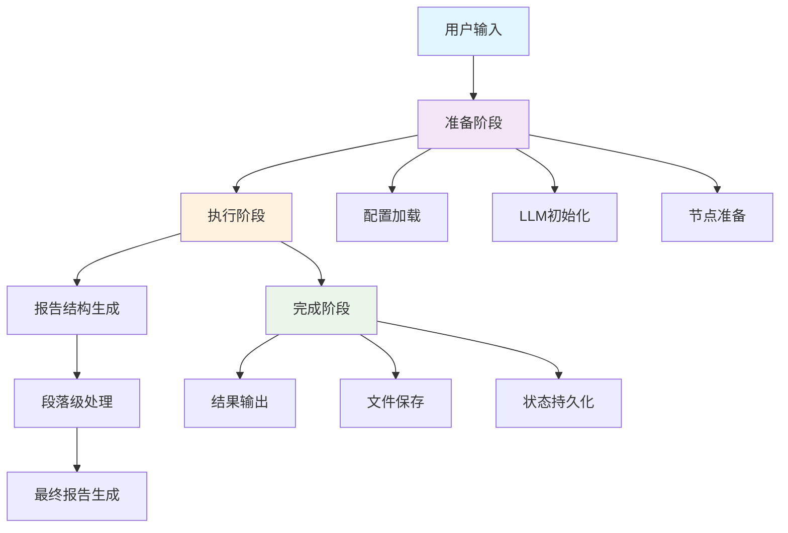
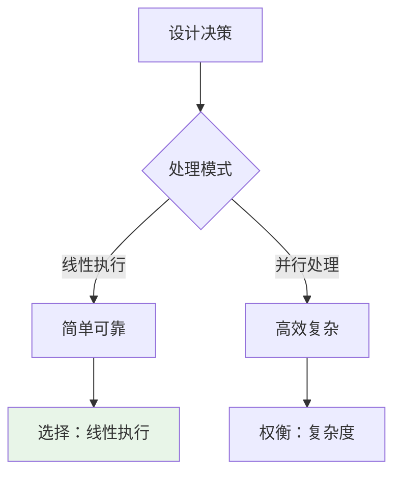
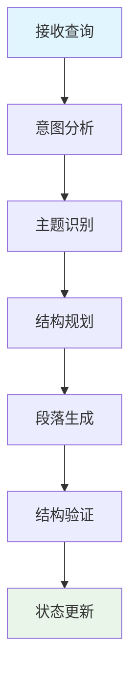
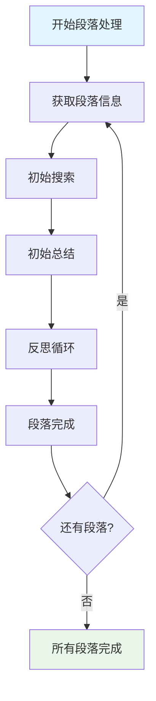
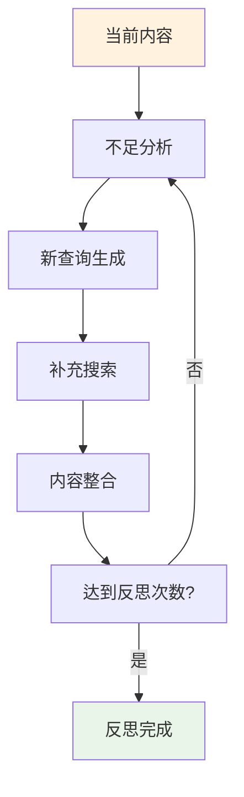
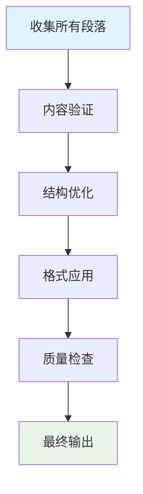
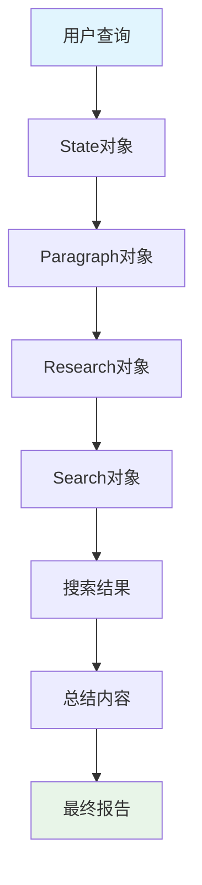
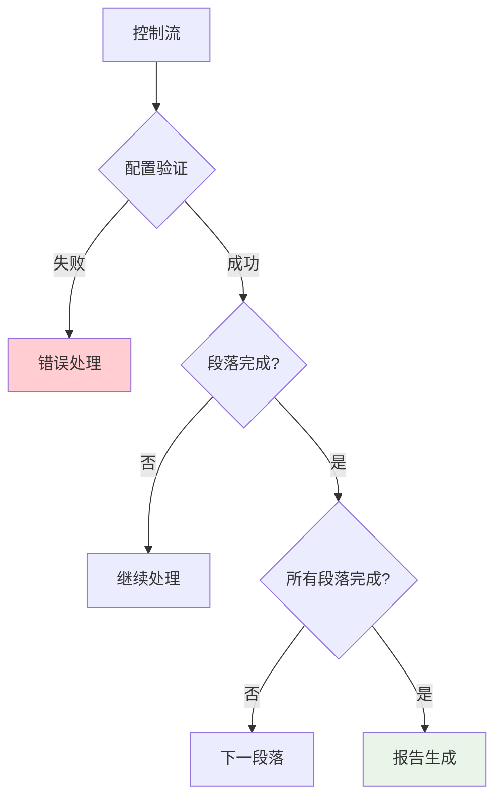
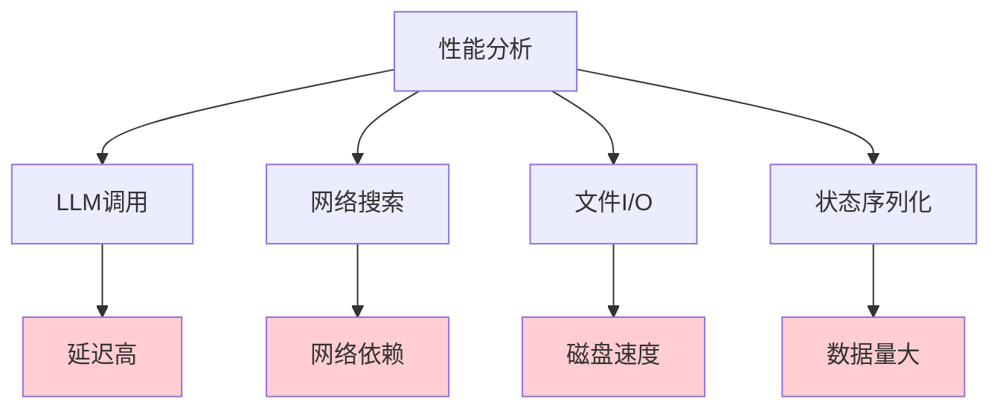

# 📚 第六章：工作流分析

## 🧭 导航链接
- [📖 返回主目录](../RESEARCH_AGENT_LEARNING_MANUAL.md)
- [⬅️ 上一章：状态管理系统](./chapter-05-state-management.md)
- [➡️ 下一章：递归设计](../phase-02-deep-research/chapter-07-recursive-design.md)

## ⏰ 学习时间：45分钟

## 🎯 本章目标
- 完整理解DeepSearchAgent-Demo的端到端工作流程
- 掌握各个组件的协作机制和数据流转
- 分析工作流程中的关键决策点
- 理解流程设计对系统性能和用户体验的影响

---

## 🔄 第一部分：整体工作流程概览（15分钟）

### 🎯 端到端流程图

DeepSearchAgent-Demo的完整工作流程可以分为三个主要阶段：

### 📋 流程阶段详解

#### 阶段一：准备阶段（Setup Phase）
- **目标**：为研究任务做好准备
- **关键活动**：配置验证、资源初始化、环境检查
- **成功标准**：所有组件就绪，可以开始处理

#### 阶段二：执行阶段（Execution Phase）
- **目标**：完成核心的研究和报告生成
- **关键活动**：结构生成、搜索处理、内容整合
- **成功标准**：所有段落完成研究，报告生成完毕

#### 阶段三：完成阶段（Completion Phase）
- **目标**：完成输出和清理工作
- **关键活动**：结果展示、文件保存、状态持久化
- **成功标准**：用户获得最终报告，系统状态保存

### 🎭 关键设计决策

#### 1. **线性执行 vs 并行处理**

#### 2. **即时处理 vs 批量处理**
- **即时处理**：每个段落完成后立即处理下一个
- **批量处理**：所有段落搜索完成后再进行总结

#### 3. **失败处理策略**
- **快速失败**：遇到错误立即停止
- **容错继续**：跳过错误部分继续执行
- **重试机制**：自动重试失败的操作

---

## 🏗️ 第二部分：核心执行流程深度解析（15分钟）

### 🎯 步骤1：报告结构生成

#### 触发条件
- 用户查询输入完成
- 系统初始化成功
- 配置参数验证通过

#### 执行流程

#### 关键决策点
- **段落数量**：根据查询复杂度决定段落数量
- **内容深度**：平衡详细程度和执行时间
- **结构类型**：选择最适合的报告结构模式

#### 输出结果
- 结构化的段落列表
- 每个段落的标题和内容描述
- 整体报告的框架结构

### 🔄 步骤2：段落级处理循环

#### 循环控制逻辑

#### 初始搜索和总结

#### 反思循环机制

### 🎨 步骤3：最终报告生成

#### 整合策略

#### 格式化处理
- **Markdown转换**：将结构化内容转换为Markdown格式
- **样式应用**：应用标题、列表、链接等格式
- **内容优化**：调整段落间的过渡和衔接

---

## 📊 第三部分：数据流和控制流分析（10分钟）

### 🔄 数据流分析

#### 主要数据对象

#### 数据转换过程
| 阶段 | 输入数据 | 输出数据 | 转换逻辑 |
|------|----------|----------|----------|
| **结构生成** | 用户查询 | 段落列表 | 意图解析+结构规划 |
| **搜索处理** | 段落信息 | 搜索结果 | 查询生成+结果获取 |
| **内容总结** | 搜索结果 | 段落内容 | 信息提取+内容整合 |
| **报告生成** | 所有段落 | 最终报告 | 内容整合+格式化 |

### 🎮 控制流分析

#### 决策节点

#### 异常处理机制
- **配置错误**：启动阶段检查，快速失败
- **搜索失败**：重试机制，降级处理
- **LLM错误**：备用模型，错误恢复
- **文件错误**：权限检查，路径验证

### ⚡ 性能瓶颈分析

#### 潜在瓶颈点

#### 优化策略
- **LLM调用优化**：批量处理、结果缓存
- **网络搜索优化**：并发请求、结果复用
- **文件I/O优化**：异步写入、缓冲机制
- **状态管理优化**：增量更新、压缩存储

---

## 🎯 第四部分：工作流程优化思考（5分钟）

### 🎭 流程设计权衡

#### 可靠性 vs 效率
- **可靠性优先**：更多的检查点、错误处理
- **效率优先**：并行处理、减少开销
- **平衡策略**：关键节点可靠性，非关键路径效率

#### 灵活性 vs 简单性
- **灵活性**：可配置的流程、动态调整
- **简单性**：固定流程、易于理解和维护
- **权衡结果**：核心流程简单，扩展接口灵活

#### 用户体验 vs 系统复杂度
- **用户体验**：进度显示、中断恢复
- **系统复杂度**：更多的状态管理、错误处理
- **平衡点**：必要的用户体验，适度的系统复杂度

### 💡 改进方向

#### 1. **并行化改进**
- 段落级并行处理
- 搜索请求并发执行
- 异步I/O操作

#### 2. **智能化改进**
- 自适应反思次数
- 动态查询优化
- 智能资源调度

#### 3. **用户体验改进**
- 实时进度显示
- 中断恢复机制
- 结果预览功能

### 💭 思考练习

1. **流程优化**：如果你要优化DeepSearchAgent-Demo的执行效率，会从哪些方面入手？

2. **错误处理**：当前的工作流程中，哪些地方最容易出错？如何改进？

3. **扩展设计**：如果要支持多人协作研究，工作流程需要如何调整？

---

## 📚 本章小结

### ✅ 核心要点

1. **DeepSearchAgent-Demo采用了清晰的三阶段工作流程**
2. **段落级处理是核心的循环执行模式**
3. **数据流和控制流的设计体现了良好的软件工程实践**
4. **工作流程设计需要在多个维度上进行权衡**

### 🚀 下一步

在下一阶段中，我们将学习deep-research项目的递归架构，看看不同的设计哲学如何影响系统行为。

### 📖 延伸阅读

- 《工作流引擎设计模式》
- 《并发编程实践》
- 《系统性能优化方法》

---

**⏰ 完成时间检查**：确保你在45分钟内完成了本章学习。重点理解工作流程的设计思路和优化方向。