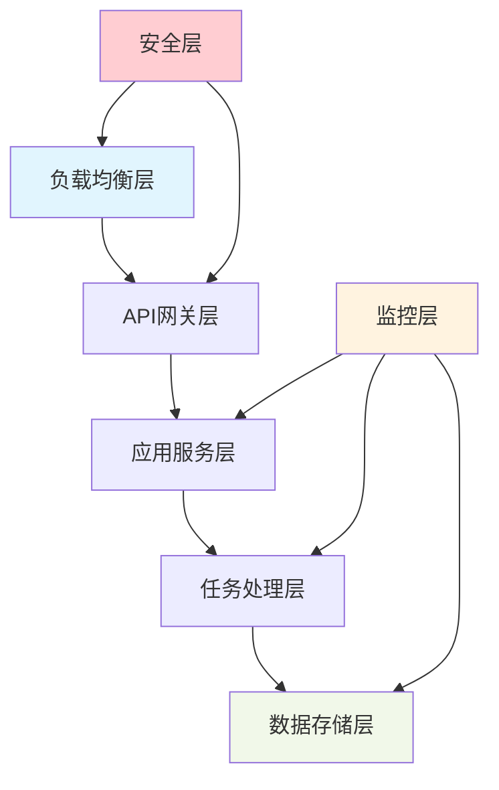
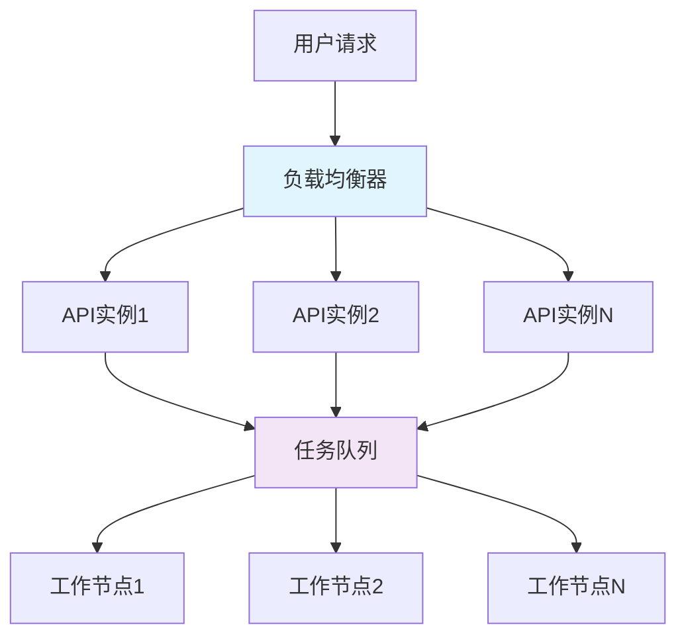
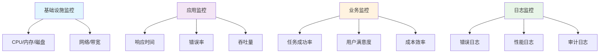
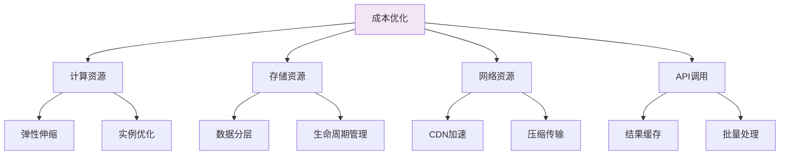

# 📚 第十三章：Research Agent 生产部署

## 🧭 导航链接
- [📖 返回主目录](../RESEARCH_AGENT_LEARNING_MANUAL.md)
- [⬅️ 上一章：MCP 生态系统](../phase-02-claude-agent-sdk/chapter-12-mcp-ecosystem.md)
- [➡️ 下一章：性能调优](./chapter-14-performance-tuning.md)

## ⏰ 学习时间：45分钟

## 🎯 本章目标
- 掌握Research Agent生产环境的部署策略
- 理解可扩展性和高可用的架构设计
- 学习监控、日志和运维的最佳实践
- 分析生产环境下的性能优化和成本控制

---

## 🏭 第一部分：生产部署架构（15分钟）

### 🎯 生产环境需求分析

生产环境对Research Agent有特殊要求：

#### 1. **高可用性**
- 7x24小时稳定运行
- 故障自动恢复
- 多地域部署
- 负载均衡

#### 2. **可扩展性**
- 水平扩展能力
- 弹性伸缩
- 资源池化
- 微服务架构

#### 3. **安全性**
- 网络安全防护
- 数据加密传输
- 访问权限控制
- 安全审计

#### 4. **可观测性**
- 全链路监控
- 性能指标收集
- 日志聚合分析
- 告警机制

### 🏗️ 部署架构设计

#### 分层部署架构


#### 容器化部署
```yaml
# docker-compose.yml
version: '3.8'
services:
  research-agent-api:
    image: research-agent:latest
    ports:
      - "8080:8080"
    environment:
      - ENV=production
      - DATABASE_URL=${DATABASE_URL}
      - REDIS_URL=${REDIS_URL}
    depends_on:
      - redis
      - postgres
    deploy:
      replicas: 3
      resources:
        limits:
          cpus: '1.0'
          memory: 2G
  
  redis:
    image: redis:7-alpine
    volumes:
      - redis_data:/data
    command: redis-server --appendonly yes
  
  postgres:
    image: postgres:15
    environment:
      - POSTGRES_DB=research_agent
      - POSTGRES_USER=${DB_USER}
      - POSTGRES_PASSWORD=${DB_PASSWORD}
    volumes:
      - postgres_data:/var/lib/postgresql/data

volumes:
  redis_data:
  postgres_data:
```

---

## ⚡ 第二部分：可扩展性和性能优化（15分钟）

### 🎯 扩展性设计策略

#### 水平扩展架构


#### 扩展性实现机制
```python
class ScalableResearchAgent:
    def __init__(self):
        self.task_queue = RedisQueue('research_tasks')
        self.result_store = RedisStore('results')
        self.worker_pool = WorkerPool()
    
    async def submit_research(self, query: str, options: dict):
        """提交研究任务"""
        task_id = generate_task_id()
        
        task = {
            'id': task_id,
            'query': query,
            'options': options,
            'status': 'pending',
            'created_at': datetime.utcnow()
        }
        
        # 任务入队
        await self.task_queue.enqueue(task)
        
        return task_id
    
    async def get_result(self, task_id: str):
        """获取研究结果"""
        return await self.result_store.get(task_id)

class WorkerPool:
    def __init__(self, min_workers=2, max_workers=10):
        self.min_workers = min_workers
        self.max_workers = max_workers
        self.workers = []
        self.task_queue = RedisQueue('research_tasks')
    
    async def scale_workers(self):
        """动态扩展工作节点"""
        queue_length = await self.task_queue.length()
        current_workers = len(self.workers)
        
        # 扩容条件
        if queue_length > current_workers * 2 and current_workers < self.max_workers:
            new_workers = min(queue_length // 2, self.max_workers - current_workers)
            for _ in range(new_workers):
                worker = ResearchWorker()
                await worker.start()
                self.workers.append(worker)
        
        # 缩容条件
        elif queue_length < current_workers // 2 and current_workers > self.min_workers:
            remove_workers = current_workers // 4
            for _ in range(remove_workers):
                worker = self.workers.pop()
                await worker.stop()
```

### 🚀 性能优化策略

#### 1. **缓存优化**
```python
class MultiLevelCache:
    def __init__(self):
        self.l1_cache = {}  # 内存缓存
        self.l2_cache = RedisCache()  # Redis缓存
        self.l3_cache = DatabaseCache()  # 数据库缓存
    
    async def get(self, key: str):
        # L1缓存查找
        if key in self.l1_cache:
            return self.l1_cache[key]
        
        # L2缓存查找
        result = await self.l2_cache.get(key)
        if result:
            self.l1_cache[key] = result  # 提升到L1
            return result
        
        # L3缓存查找
        result = await self.l3_cache.get(key)
        if result:
            await self.l2_cache.set(key, result)  # 提升到L2
            self.l1_cache[key] = result
            return result
        
        return None
```

#### 2. **数据库优化**
```sql
-- 研究任务表优化
CREATE TABLE research_tasks (
    id UUID PRIMARY KEY,
    query TEXT NOT NULL,
    status VARCHAR(20) NOT NULL,
    created_at TIMESTAMP NOT NULL,
    updated_at TIMESTAMP NOT NULL,
    completed_at TIMESTAMP,
    
    -- 索引优化
    INDEX idx_status_created (status, created_at),
    INDEX idx_user_created (user_id, created_at),
    
    -- 分区表（按时间分区）
    PARTITION BY RANGE (created_at)
);

-- 结果表优化
CREATE TABLE research_results (
    task_id UUID REFERENCES research_tasks(id),
    content JSONB NOT NULL,
    
    -- JSONB索引
    INDEX idx_content_gin USING GIN (content),
    INDEX idx_task_id (task_id)
);
```

#### 3. **异步处理优化**
```python
import asyncio
from asyncio import Semaphore

class OptimizedResearchProcessor:
    def __init__(self, max_concurrent=10):
        self.semaphore = Semaphore(max_concurrent)
        self.session_pool = aiohttp.ClientSession()
    
    async def process_batch(self, tasks: List[ResearchTask]):
        """批量并发处理"""
        coroutines = [self.process_single_task(task) for task in tasks]
        results = await asyncio.gather(*coroutines, return_exceptions=True)
        
        return results
    
    async def process_single_task(self, task: ResearchTask):
        async with self.semaphore:
            try:
                # 并发搜索
                search_tasks = [
                    self.search_provider.search(query) 
                    for query in task.search_queries
                ]
                search_results = await asyncio.gather(*search_tasks)
                
                # 并发处理结果
                processing_tasks = [
                    self.process_result(result) 
                    for result in search_results
                ]
                processed_results = await asyncio.gather(*processing_tasks)
                
                return self.synthesize_results(processed_results)
                
            except Exception as e:
                logger.error(f"Task {task.id} failed: {e}")
                return None
```

---

## 📊 第三部分：监控和运维（10分钟）

### 🎯 监控体系设计

#### 监控层次架构


#### 关键指标监控
```python
class MetricsCollector:
    def __init__(self):
        self.prometheus_client = PrometheusClient()
        self.metrics = {
            'request_duration': Histogram('request_duration_seconds'),
            'request_count': Counter('request_count_total'),
            'active_tasks': Gauge('active_tasks'),
            'error_rate': Gauge('error_rate'),
            'cache_hit_rate': Gauge('cache_hit_rate')
        }
    
    def record_request(self, duration: float, status: str):
        self.metrics['request_duration'].observe(duration)
        self.metrics['request_count'].inc()
        
        if status >= 400:
            self.metrics['error_rate'].inc()
    
    def update_active_tasks(self, count: int):
        self.metrics['active_tasks'].set(count)
    
    def update_cache_hit_rate(self, rate: float):
        self.metrics['cache_hit_rate'].set(rate)
```

### 📝 日志管理策略

#### 结构化日志
```python
import structlog

logger = structlog.get_logger()

class ResearchAgentLogger:
    def __init__(self):
        structlog.configure(
            processors=[
                structlog.stdlib.filter_by_level,
                structlog.stdlib.add_logger_name,
                structlog.stdlib.add_log_level,
                structlog.stdlib.PositionalArgumentsFormatter(),
                structlog.processors.TimeStamper(fmt="iso"),
                structlog.processors.StackInfoRenderer(),
                structlog.processors.format_exc_info,
                structlog.processors.UnicodeDecoder(),
                structlog.processors.JSONRenderer()
            ],
            context_class=dict,
            logger_factory=structlog.stdlib.LoggerFactory(),
            wrapper_class=structlog.stdlib.BoundLogger,
            cache_logger_on_first_use=True,
        )
    
    def log_task_start(self, task_id: str, query: str, user_id: str):
        logger.info(
            "task_started",
            task_id=task_id,
            query=query,
            user_id=user_id,
            timestamp=datetime.utcnow().isoformat()
        )
    
    def log_task_completion(self, task_id: str, duration: float, result_size: int):
        logger.info(
            "task_completed",
            task_id=task_id,
            duration=duration,
            result_size=result_size,
            timestamp=datetime.utcnow().isoformat()
        )
```

### 🚨 告警机制

#### 告警规则配置
```yaml
# prometheus-alerts.yml
groups:
  - name: research-agent-alerts
    rules:
      - alert: HighErrorRate
        expr: error_rate > 0.1
        for: 5m
        labels:
          severity: warning
        annotations:
          summary: "Research Agent error rate is high"
          description: "Error rate is {{ $value }} for the last 5 minutes"
      
      - alert: LongResponseTime
        expr: request_duration_seconds{quantile="0.95"} > 30
        for: 2m
        labels:
          severity: critical
        annotations:
          summary: "Research Agent response time is too long"
          description: "95th percentile response time is {{ $value }} seconds"
      
      - alert: TaskQueueBacklog
        expr: active_tasks > 100
        for: 10m
        labels:
          severity: warning
        annotations:
          summary: "Task queue has large backlog"
          description: "{{ $value }} active tasks in queue"
```

---

## 🎯 第四部分：成本控制和运维最佳实践（5分钟）

### 💰 成本优化策略

#### 资源使用优化


#### 成本监控和控制
```python
class CostController:
    def __init__(self, monthly_budget: float):
        self.monthly_budget = monthly_budget
        self.current_spend = 0.0
        self.daily_limit = monthly_budget / 30
        
    async def check_budget(self, operation_cost: float) -> bool:
        """检查预算是否允许操作"""
        daily_spend = await self.get_daily_spend()
        
        if daily_spend + operation_cost > self.daily_limit:
            logger.warning(f"Daily budget exceeded: {daily_spend + operation_cost}")
            return False
        
        if self.current_spend + operation_cost > self.monthly_budget:
            logger.error(f"Monthly budget exceeded: {self.current_spend + operation_cost}")
            return False
        
        return True
    
    async def optimize_operation(self, operation: ResearchOperation):
        """优化操作以降低成本"""
        
        # 使用更便宜的模型
        if operation.priority == 'low':
            operation.model = 'gpt-3.5-turbo'
        
        # 减少搜索深度
        if self.current_spend > self.monthly_budget * 0.8:
            operation.max_depth = min(operation.max_depth, 2)
            operation.max_results = min(operation.max_results, 3)
        
        # 启用更多缓存
        operation.use_cache = True
        operation.cache_ttl = 3600  # 1小时缓存
```

### 🔧 运维最佳实践

#### 1. **自动化部署**
- CI/CD流水线
- 蓝绿部署
- 金丝雀发布
- 自动回滚

#### 2. **故障恢复**
- 健康检查
- 自动重启
- 故障转移
- 数据备份

#### 3. **性能调优**
- 定期性能分析
- 资源使用优化
- 查询优化
- 缓存策略调整

### 💭 思考练习

1. **架构设计**：设计一个支持每秒1000个请求的Research Agent系统架构。

2. **成本优化**：在保证服务质量的前提下，如何将运营成本降低30%？

3. **故障处理**：当Research Agent系统出现大规模故障时，你的应急响应流程是什么？

---

## 📚 本章小结

### ✅ 核心要点

1. **生产部署需要考虑高可用、可扩展、安全性和可观测性**
2. **容器化和微服务架构是实现可扩展性的关键技术**
3. **多级缓存和异步处理是性能优化的核心策略**
4. **完善的监控和告警机制是生产稳定运行的保障**

### 🚀 下一步

在下一章中，我们将学习Research Agent的性能调优技巧，了解如何进一步优化系统性能。

### 📖 延伸阅读

- 《大规模系统部署实践》
- 《云原生应用架构》
- 《SRE运维实践指南》

---

**⏰ 完成时间检查**：确保你在45分钟内完成了本章学习。重点理解生产部署的架构设计和运维策略。