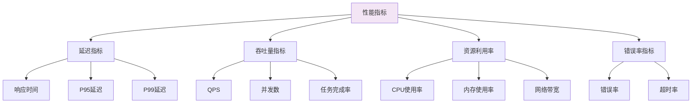
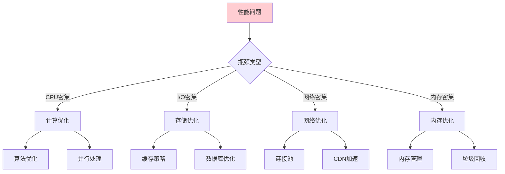
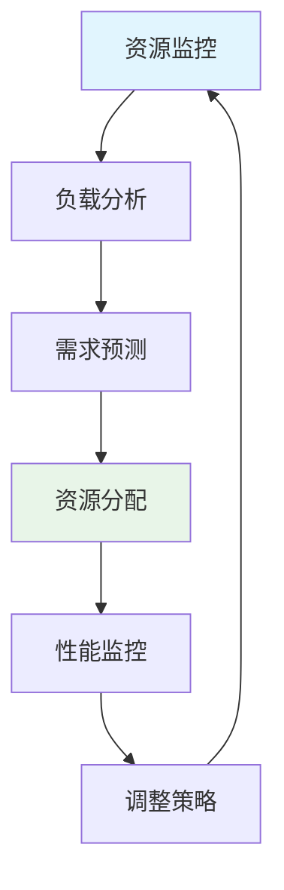
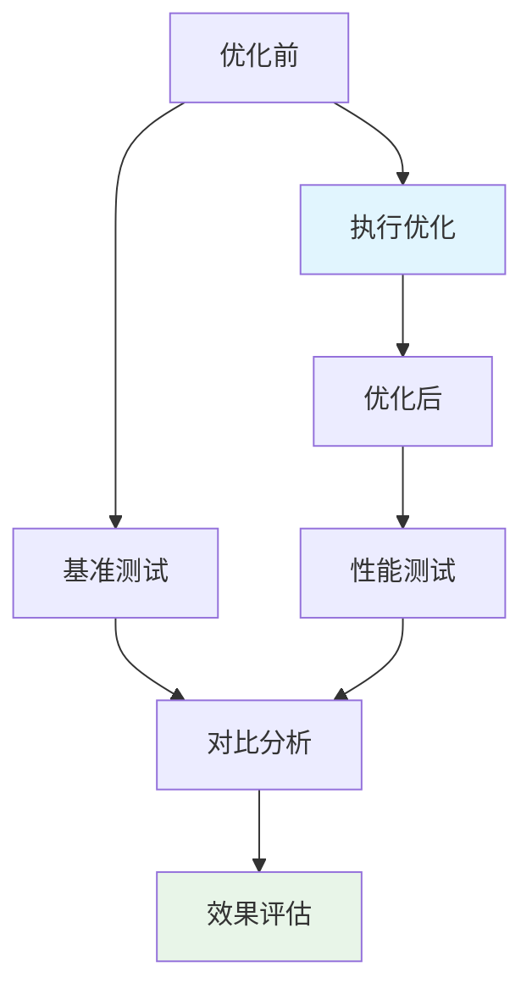

# 📚 第十四章：Research Agent 性能调优

## 🧭 导航链接
- [📖 返回主目录](../RESEARCH_AGENT_LEARNING_MANUAL.md)
- [⬅️ 上一章：生产部署](./chapter-13-production-deployment.md)
- [➡️ 下一章：未来趋势](./chapter-15-future-trends.md)

## ⏰ 学习时间：45分钟

## 🎯 本章目标
- 掌握Research Agent系统的性能分析和优化方法
- 学习多层次的性能调优策略
- 理解资源管理和负载均衡的最佳实践
- 分析性能优化的权衡和效果评估

---

## ⚡ 第一部分：性能分析基础（15分钟）

### 🎯 性能指标体系

#### 核心性能指标


#### 性能基准测试
```python
class PerformanceBenchmark:
    def __init__(self):
        self.metrics = {
            'response_times': [],
            'throughput': [],
            'error_rates': [],
            'resource_usage': []
        }
    
    async def benchmark_research_agent(self, test_cases: List[TestCase]):
        """执行基准测试"""
        results = []
        
        for test_case in test_cases:
            start_time = time.time()
            
            try:
                result = await self.research_agent.research(test_case.query)
                
                end_time = time.time()
                response_time = end_time - start_time
                
                # 记录性能数据
                self.metrics['response_times'].append(response_time)
                
                results.append({
                    'test_case': test_case,
                    'result': result,
                    'response_time': response_time,
                    'success': True
                })
                
            except Exception as e:
                end_time = time.time()
                response_time = end_time - start_time
                
                self.metrics['error_rates'].append(1)
                
                results.append({
                    'test_case': test_case,
                    'error': str(e),
                    'response_time': response_time,
                    'success': False
                })
        
        return self.analyze_results(results)
    
    def analyze_results(self, results: List[dict]) -> dict:
        """分析测试结果"""
        response_times = [r['response_time'] for r in results]
        success_rate = sum(1 for r in results if r['success']) / len(results)
        
        return {
            'avg_response_time': sum(response_times) / len(response_times),
            'p95_response_time': sorted(response_times)[int(len(response_times) * 0.95)],
            'p99_response_time': sorted(response_times)[int(len(response_times) * 0.99)],
            'success_rate': success_rate,
            'throughput': len(results) / max(response_times)
        }
```

### 🔍 性能瓶颈识别

#### 瓶颈分析框架


#### 性能分析工具
```python
class PerformanceProfiler:
    def __init__(self):
        self.profilers = {
            'cpu': CPUProfiler(),
            'memory': MemoryProfiler(),
            'io': IOProfiler(),
            'network': NetworkProfiler()
        }
    
    @contextmanager
    def profile_context(self, operation_name: str):
        """性能分析上下文管理器"""
        # 开始分析
        for profiler in self.profilers.values():
            profiler.start()
        
        start_time = time.time()
        
        try:
            yield
        finally:
            # 结束分析
            end_time = time.time()
            duration = end_time - start_time
            
            # 收集分析结果
            profile_data = {
                'operation': operation_name,
                'duration': duration,
                'cpu': self.profilers['cpu'].get_stats(),
                'memory': self.profilers['memory'].get_stats(),
                'io': self.profilers['io'].get_stats(),
                'network': self.profilers['network'].get_stats()
            }
            
            # 保存分析结果
            self.save_profile_data(profile_data)
    
    def identify_bottlenecks(self, profile_data: dict) -> List[str]:
        """识别性能瓶颈"""
        bottlenecks = []
        
        # CPU瓶颈
        if profile_data['cpu']['usage'] > 80:
            bottlenecks.append('CPU')
        
        # 内存瓶颈
        if profile_data['memory']['usage'] > 85:
            bottlenecks.append('Memory')
        
        # I/O瓶颈
        if profile_data['io']['wait_time'] > profile_data['duration'] * 0.3:
            bottlenecks.append('I/O')
        
        # 网络瓶颈
        if profile_data['network']['latency'] > 100:  # ms
            bottlenecks.append('Network')
        
        return bottlenecks
```

---

## 🚀 第二部分：多层次优化策略（15分钟）

### 🎯 应用层优化

#### 1. **算法优化**
```python
class OptimizedSearchEngine:
    def __init__(self):
        self.query_cache = LRUCache(maxsize=1000)
        self.result_cache = TTLCache(maxsize=500, ttl=3600)
        self.index = SearchIndex()
    
    async def search(self, query: str, max_results: int = 10) -> List[SearchResult]:
        """优化的搜索实现"""
        
        # 1. 查询标准化和缓存
        normalized_query = self.normalize_query(query)
        cache_key = f"{normalized_query}:{max_results}"
        
        if cache_key in self.result_cache:
            return self.result_cache[cache_key]
        
        # 2. 智能查询扩展
        expanded_queries = self.expand_query(normalized_query)
        
        # 3. 并发搜索执行
        search_tasks = [
            self.execute_search(expanded_query, max_results // len(expanded_queries))
            for expanded_query in expanded_queries
        ]
        
        search_results = await asyncio.gather(*search_tasks)
        
        # 4. 结果合并和去重
        merged_results = self.merge_and_deduplicate(search_results)
        
        # 5. 相关性重排序
        final_results = self.rerank_by_relevance(merged_results, query)
        
        # 6. 缓存结果
        self.result_cache[cache_key] = final_results
        
        return final_results[:max_results]
    
    def expand_query(self, query: str) -> List[str]:
        """智能查询扩展"""
        # 使用同义词词典和查询历史扩展查询
        expansions = []
        
        # 同义词扩展
        synonyms = self.get_synonyms(query)
        expansions.extend(synonyms)
        
        # 历史查询扩展
        similar_queries = self.get_similar_queries(query)
        expansions.extend(similar_queries[:2])  # 限制扩展数量
        
        return [query] + expansions
```

#### 2. **并发优化**
```python
class ConcurrentProcessor:
    def __init__(self, max_workers: int = None):
        self.max_workers = max_workers or os.cpu_count() * 2
        self.semaphore = asyncio.Semaphore(self.max_workers)
        self.executor = ThreadPoolExecutor(max_workers=self.max_workers)
    
    async def process_research_tasks(self, tasks: List[ResearchTask]) -> List[ResearchResult]:
        """并发处理研究任务"""
        
        # 任务分组：按优先级和资源需求分组
        high_priority_tasks = [t for t in tasks if t.priority == 'high']
        normal_priority_tasks = [t for t in tasks if t.priority == 'normal']
        low_priority_tasks = [t for t in tasks if t.priority == 'low']
        
        results = []
        
        # 按优先级处理
        for task_group in [high_priority_tasks, normal_priority_tasks, low_priority_tasks]:
            if not task_group:
                continue
            
            # 并发处理同优先级任务
            group_results = await self.process_task_group(task_group)
            results.extend(group_results)
        
        return results
    
    async def process_task_group(self, tasks: List[ResearchTask]) -> List[ResearchResult]:
        """处理任务组"""
        semaphore = asyncio.Semaphore(min(len(tasks), self.max_workers))
        
        async def process_single_task(task):
            async with semaphore:
                return await self.process_task(task)
        
        # 创建并发任务
        coroutines = [process_single_task(task) for task in tasks]
        
        # 并发执行
        results = await asyncio.gather(*coroutines, return_exceptions=True)
        
        # 处理异常
        processed_results = []
        for i, result in enumerate(results):
            if isinstance(result, Exception):
                logger.error(f"Task {tasks[i].id} failed: {result}")
                processed_results.append(ResearchResult.error(tasks[i].id, str(result)))
            else:
                processed_results.append(result)
        
        return processed_results
```

### 🗄️ 数据层优化

#### 1. **数据库优化**
```sql
-- 索引优化策略
CREATE INDEX CONCURRENTLY idx_research_tasks_status_created 
ON research_tasks(status, created_at DESC);

CREATE INDEX CONCURRENTLY idx_research_results_task_id 
ON research_results(task_id);

CREATE INDEX CONCURRENTLY idx_search_logs_query_timestamp 
ON search_logs(query, timestamp DESC);

-- 分区表优化
CREATE TABLE research_tasks_partitioned (
    LIKE research_tasks INCLUDING ALL
) PARTITION BY RANGE (created_at);

CREATE TABLE research_tasks_2024_01 PARTITION OF research_tasks_partitioned
FOR VALUES FROM ('2024-01-01') TO ('2024-02-01');

-- 查询优化
EXPLAIN (ANALYZE, BUFFERS) 
SELECT t.id, t.query, t.status 
FROM research_tasks t 
WHERE t.status = 'pending' 
ORDER BY t.created_at DESC 
LIMIT 100;
```

#### 2. **缓存策略优化**
```python
class AdvancedCacheManager:
    def __init__(self):
        self.l1_cache = {}  # 内存缓存
        self.l2_cache = RedisCache()  # Redis缓存
        self.cache_stats = defaultdict(int)
    
    async def get(self, key: str, compute_func: Callable, ttl: int = 3600):
        """多级缓存获取"""
        
        # L1缓存查找
        if key in self.l1_cache:
            self.cache_stats['l1_hits'] += 1
            return self.l1_cache[key]
        
        # L2缓存查找
        l2_result = await self.l2_cache.get(key)
        if l2_result:
            self.l1_cache[key] = l2_result
            self.cache_stats['l2_hits'] += 1
            return l2_result
        
        # 计算结果
        result = await compute_func()
        
        # 存储到缓存
        self.l1_cache[key] = result
        await self.l2_cache.set(key, result, ttl=ttl)
        
        self.cache_stats['computes'] += 1
        return result
    
    def get_cache_stats(self) -> dict:
        """获取缓存统计"""
        total_requests = sum(self.cache_stats.values())
        if total_requests == 0:
            return {'hit_rate': 0}
        
        hits = self.cache_stats['l1_hits'] + self.cache_stats['l2_hits']
        hit_rate = hits / total_requests
        
        return {
            'hit_rate': hit_rate,
            'l1_hit_rate': self.cache_stats['l1_hits'] / total_requests,
            'l2_hit_rate': self.cache_stats['l2_hits'] / total_requests,
            'total_requests': total_requests
        }
```

---

## 📊 第三部分：资源管理和负载均衡（10分钟）

### 🎯 资源管理策略

#### 动态资源分配


#### 自适应资源管理
```python
class AdaptiveResourceManager:
    def __init__(self, initial_resources: ResourceConfig):
        self.current_config = initial_resources
        self.monitoring = ResourceMonitor()
        self.adjustment_history = []
    
    async def adaptive_scaling(self):
        """自适应资源调整"""
        
        while True:
            # 1. 收集性能指标
            metrics = await self.monitoring.collect_metrics()
            
            # 2. 分析资源使用情况
            analysis = self.analyze_resource_usage(metrics)
            
            # 3. 决定调整策略
            adjustments = self.decide_adjustments(analysis)
            
            # 4. 执行资源调整
            if adjustments:
                await self.execute_adjustments(adjustments)
                self.adjustment_history.append({
                    'timestamp': datetime.utcnow(),
                    'metrics': metrics,
                    'adjustments': adjustments
                })
            
            # 5. 等待下次调整
            await asyncio.sleep(60)  # 每分钟检查一次
    
    def analyze_resource_usage(self, metrics: dict) -> dict:
        """分析资源使用情况"""
        return {
            'cpu_pressure': metrics['cpu_usage'] / 100,
            'memory_pressure': metrics['memory_usage'] / 100,
            'request_rate': metrics['requests_per_second'],
            'response_time_p95': metrics['response_time_p95'],
            'error_rate': metrics['error_rate']
        }
    
    def decide_adjustments(self, analysis: dict) -> List[ResourceAdjustment]:
        """决定资源调整策略"""
        adjustments = []
        
        # CPU压力调整
        if analysis['cpu_pressure'] > 0.8:
            adjustments.append(ResourceAdjustment(
                type='scale_out',
                resource='cpu',
                amount=2,
                reason='high_cpu_pressure'
            ))
        elif analysis['cpu_pressure'] < 0.3:
            adjustments.append(ResourceAdjustment(
                type='scale_in',
                resource='cpu',
                amount=1,
                reason='low_cpu_pressure'
            ))
        
        # 内存压力调整
        if analysis['memory_pressure'] > 0.85:
            adjustments.append(ResourceAdjustment(
                type='scale_out',
                resource='memory',
                amount=2048,  # MB
                reason='high_memory_pressure'
            ))
        
        return adjustments
```

### ⚖️ 负载均衡策略

#### 智能负载分配
```python
class IntelligentLoadBalancer:
    def __init__(self):
        self.nodes = []
        self.health_checker = HealthChecker()
        self.routing_strategy = WeightedRoundRobin()
    
    async def distribute_request(self, request: ResearchRequest) -> ResearchNode:
        """智能请求分发"""
        
        # 1. 获取健康节点
        healthy_nodes = await self.get_healthy_nodes()
        
        if not healthy_nodes:
            raise NoHealthyNodesError("No healthy nodes available")
        
        # 2. 根据请求特征选择节点
        if request.complexity == 'high':
            # 复杂请求分配给高性能节点
            suitable_nodes = [n for n in healthy_nodes if n.performance_score > 0.8]
        elif request.priority == 'urgent':
            # 紧急请求分配给负载最低的节点
            suitable_nodes = sorted(healthy_nodes, key=lambda n: n.current_load)
        else:
            suitable_nodes = healthy_nodes
        
        # 3. 应用路由策略
        selected_node = self.routing_strategy.select_node(suitable_nodes, request)
        
        # 4. 更新节点状态
        selected_node.current_load += 1
        selected_node.request_count += 1
        
        return selected_node
    
    async def get_healthy_nodes(self) -> List[ResearchNode]:
        """获取健康节点列表"""
        healthy_nodes = []
        
        for node in self.nodes:
            if await self.health_checker.is_healthy(node):
                healthy_nodes.append(node)
        
        return healthy_nodes

class WeightedRoundRobin:
    def __init__(self):
        self.current_weights = {}
    
    def select_node(self, nodes: List[ResearchNode], request: ResearchRequest) -> ResearchNode:
        """加权轮询选择节点"""
        
        if not nodes:
            return None
        
        # 计算权重
        total_weight = sum(node.performance_score * (100 - node.current_load) for node in nodes)
        
        if total_weight == 0:
            return random.choice(nodes)
        
        # 选择节点
        random_value = random.uniform(0, total_weight)
        current_weight = 0
        
        for node in nodes:
            node_weight = node.performance_score * (100 - node.current_load)
            current_weight += node_weight
            
            if current_weight >= random_value:
                return node
        
        return nodes[-1]  # fallback
```

---

## 🎯 第四部分：性能优化的评估和权衡（5分钟）

### 📈 优化效果评估

#### 性能提升度量


#### ROI分析
```python
class OptimizationROI:
    def __init__(self):
        self.metrics_before = {}
        self.metrics_after = {}
        self.optimization_costs = {}
    
    def calculate_roi(self, optimization_name: str) -> dict:
        """计算优化投资回报率"""
        
        before_metrics = self.metrics_before[optimization_name]
        after_metrics = self.metrics_after[optimization_name]
        costs = self.optimization_costs[optimization_name]
        
        # 性能提升
        response_time_improvement = (
            before_metrics['avg_response_time'] - after_metrics['avg_response_time']
        ) / before_metrics['avg_response_time']
        
        throughput_improvement = (
            after_metrics['throughput'] - before_metrics['throughput']
        ) / before_metrics['throughput']
        
        # 成本节省（基于性能提升估算）
        monthly_savings = self.estimate_cost_savings(
            response_time_improvement, 
            throughput_improvement
        )
        
        # ROI计算
        roi = (monthly_savings * 12 - costs) / costs
        
        return {
            'response_time_improvement': response_time_improvement,
            'throughput_improvement': throughput_improvement,
            'monthly_savings': monthly_savings,
            'annual_roi': roi,
            'payback_period_months': costs / monthly_savings if monthly_savings > 0 else float('inf')
        }
```

### ⚖️ 优化权衡分析

#### 常见权衡场景
| 优化策略 | 性能提升 | 复杂度增加 | 成本增加 | 维护成本 |
|----------|----------|------------|----------|----------|
| **缓存优化** | 高 | 中 | 中 | 低 |
| **并发处理** | 高 | 高 | 中 | 高 |
| **数据库优化** | 中 | 中 | 低 | 中 |
| **资源扩展** | 高 | 低 | 高 | 低 |

#### 决策框架
```python
class OptimizationDecisionFramework:
    def __init__(self):
        self.criteria = {
            'performance_impact': 0.4,
            'implementation_complexity': 0.2,
            'cost': 0.2,
            'maintenance_overhead': 0.2
        }
    
    def evaluate_optimization(self, optimization: OptimizationOption) -> float:
        """评估优化方案的综合得分"""
        
        scores = {
            'performance_impact': self.score_performance_impact(optimization),
            'implementation_complexity': self.score_complexity(optimization, inverse=True),
            'cost': self.score_cost(optimization, inverse=True),
            'maintenance_overhead': self.score_maintenance(optimization, inverse=True)
        }
        
        # 加权计算总分
        total_score = sum(
            scores[criterion] * weight 
            for criterion, weight in self.criteria.items()
        )
        
        return total_score
    
    def recommend_optimizations(self, options: List[OptimizationOption]) -> List[OptimizationOption]:
        """推荐优化方案"""
        
        scored_options = [
            (option, self.evaluate_optimization(option))
            for option in options
        ]
        
        # 按得分排序
        scored_options.sort(key=lambda x: x[1], reverse=True)
        
        # 返回推荐的优化方案
        return [option for option, score in scored_options if score > 0.7]
```

### 💭 思考练习

1. **瓶颈分析**：如何系统性地识别Research Agent系统的性能瓶颈？

2. **优化优先级**：在有限的资源下，如何确定性能优化的优先级？

3. **长期维护**：如何在性能优化和代码可维护性之间找到平衡？

---

## 📚 本章小结

### ✅ 核心要点

1. **性能优化需要系统性的分析和多层次的策略**
2. **并发处理和缓存优化是提升性能的关键手段**
3. **资源管理和负载均衡确保系统的稳定性和可扩展性**
4. **性能优化需要在效果、复杂度和成本之间进行权衡**

### 🚀 下一步

在最后一章中，我们将探讨Research Agent的未来发展趋势和技术展望。

### 📖 延伸阅读

- 《系统性能优化实战》
- 《高并发系统设计》
- 《性能工程最佳实践》

---

**⏰ 完成时间检查**：确保你在45分钟内完成了本章学习。重点理解性能优化的策略和实施方法。