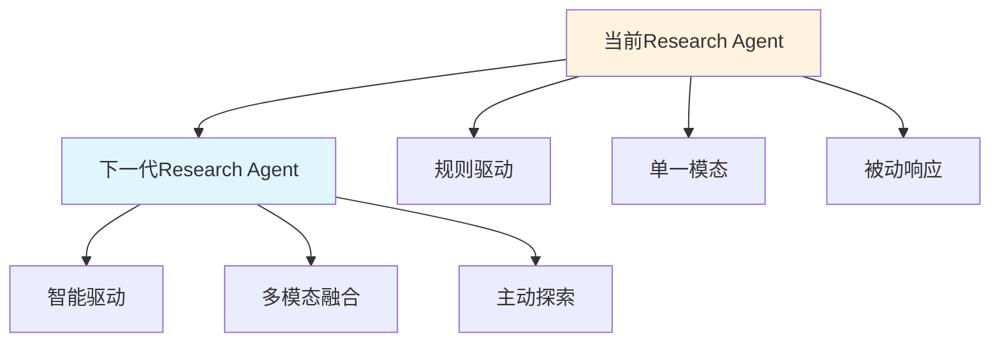
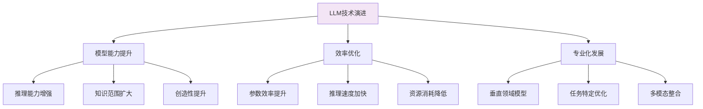
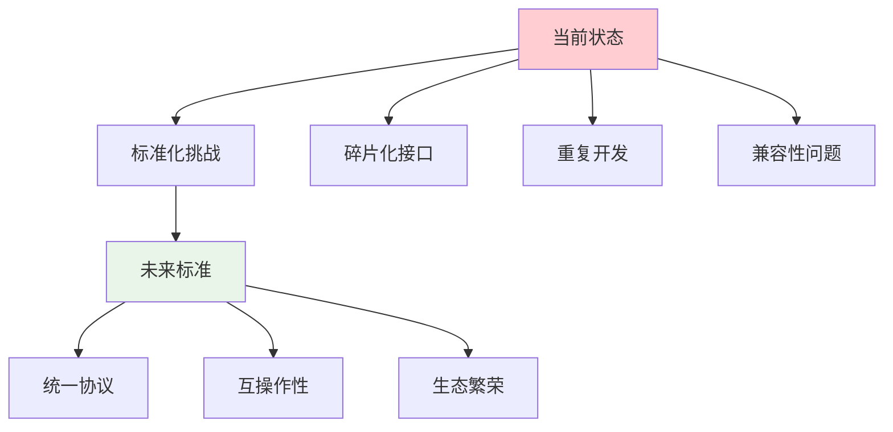
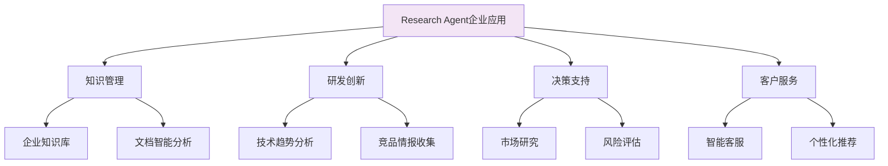
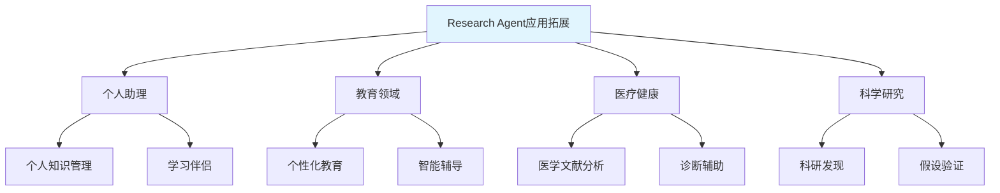
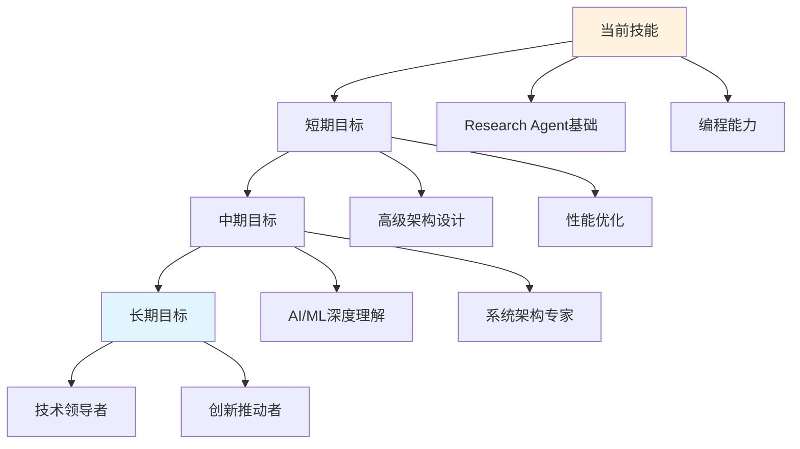

# 📚 第十五章：Research Agent 未来趋势

## 🧭 导航链接
- [📖 返回主目录](../RESEARCH_AGENT_LEARNING_MANUAL.md)
- [⬅️ 上一章：性能调优](./chapter-14-performance-tuning.md)
- [🎉 学习完成](../RESEARCH_AGENT_LEARNING_MANUAL.md#-开始学习)

## ⏰ 学习时间：45分钟

## 🎯 本章目标
- 探讨Research Agent技术发展的未来方向
- 分析新兴技术对Research Agent的影响
- 理解技术演进的趋势和挑战
- 为长期技术规划和学习提供指导

---

## 🔮 第一部分：技术发展趋势（15分钟）

### 🎯 下一代Research Agent特征

#### 智能化演进方向


#### 核心能力进化
1. **自主决策能力**
   - 从执行者到决策者
   - 自适应策略调整
   - 动态目标优化

2. **多模态理解**
   - 文本、图像、音频、视频统一处理
   - 跨模态推理和关联
   - 多媒体内容生成

3. **持续学习能力**
   - 在线学习和知识更新
   - 经验积累和模式识别
   - 个性化适应和优化

### 🧠 AI技术驱动变革

#### 大语言模型发展


#### 新兴AI技术影响
- **推理引擎**：更强的逻辑推理和数学能力
- **记忆机制**：长期记忆和知识图谱整合
- **工具使用**：更复杂的工具组合和操作序列
- **协作智能**：多Agent协同和群体智慧

---

## 🌐 第二部分：生态系统发展（15分钟）

### 🎯 标准化和开放生态

#### 技术标准演进


#### 开放生态建设
1. **协议标准化**
   - MCP协议的演进和普及
   - 跨平台兼容性标准
   - 安全和隐私标准

2. **工具生态繁荣**
   - 专业化工具市场
   - 开源工具社区
   - 商业工具生态

3. **平台化发展**
   - Research Agent即服务（RAaaS）
   - 低代码/无代码平台
   - 垂直行业解决方案

### 🏢 企业级应用普及

#### 行业应用深度


#### 企业级需求演进
- **安全合规**：更严格的安全和隐私要求
- **可解释性**：决策过程的透明和可解释
- **可控性**：人类监督和干预机制
- **集成性**：与企业现有系统的深度集成

---

## 🚀 第三部分：技术挑战和机遇（10分钟）

### 🎯 技术挑战分析

#### 核心技术难题
1. **可靠性和稳定性**
   - 复杂环境下的稳定运行
   - 异常情况的优雅处理
   - 长时间运行的性能保证

2. **可解释性和透明度**
   - 决策过程的可追溯
   - 结果的可解释性
   - 用户信任的建立

3. **安全性和隐私保护**
   - 数据安全和隐私保护
   - 对抗性攻击防护
   - 恶意使用检测

#### 技术解决方案方向
```python
class FutureResearchAgent:
    """未来Research Agent的概念设计"""
    
    def __init__(self):
        self.cognitive_engine = CognitiveEngine()
        self.memory_system = PersistentMemory()
        self.ethics_guardian = EthicsGuardian()
        self.explainer = DecisionExplainer()
    
    async def autonomous_research(self, objective: ResearchObjective):
        """自主研究能力"""
        
        # 1. 目标理解和分解
        sub_objectives = await self.cognitive_engine.decompose_objective(objective)
        
        # 2. 自适应策略制定
        strategy = await self.cognitive_engine.adapt_strategy(sub_objectives)
        
        # 3. 伦理和安全检查
        ethical_approval = await self.ethics_guardian.validate_strategy(strategy)
        if not ethical_approval:
            raise EthicsViolationError("Strategy violates ethical guidelines")
        
        # 4. 执行研究循环
        results = []
        for sub_objective in sub_objectives:
            result = await self.execute_research_subtask(sub_objective, strategy)
            
            # 5. 结果解释和验证
            explanation = await self.explainer.explain_result(result)
            validation = await self.validate_result(result, explanation)
            
            if validation.is_reliable:
                results.append(result)
        
        # 6. 知识整合和更新
        integrated_result = await self.integrate_results(results)
        await self.memory_system.update_knowledge(integrated_result)
        
        return integrated_result
    
    async def continuous_learning(self, experiences: List[ResearchExperience]):
        """持续学习能力"""
        
        # 经验分析和模式识别
        patterns = await self.cognitive_engine.identify_patterns(experiences)
        
        # 策略优化
        strategy_improvements = await self.cognitive_engine.optimize_strategies(patterns)
        
        # 知识图谱更新
        await self.memory_system.update_knowledge_graph(patterns)
        
        # 能力评估和调整
        capability_assessment = await self.assess_capabilities()
        await self.adapt_capabilities(capability_assessment)
```

### 🌟 发展机遇分析

#### 新兴技术机遇
1. **量子计算**
   - 复杂搜索空间的量子加速
   - 优化问题的量子求解
   - 密码安全的量子增强

2. **边缘计算**
   - 本地化Research Agent部署
   - 低延迟实时研究
   - 隐私保护的本地处理

3. **区块链技术**
   - 去中心化研究网络
   - 研究结果的可信验证
   - 激励机制和代币经济

#### 应用场景拓展


---

## 🎯 第四部分：学习和发展建议（5分钟）

### 🎓 持续学习路径

#### 技术技能发展


#### 知识体系构建
1. **核心技术**
   - 大语言模型原理和应用
   - 分布式系统设计
   - 数据库和缓存技术
   - 网络和安全技术

2. **交叉领域**
   - 认知科学和心理学
   - 信息检索理论
   - 人机交互设计
   - 伦理和法律考虑

3. **前沿技术**
   - 多模态AI技术
   - 强化学习和决策理论
   - 知识图谱和语义网络
   - 量子计算基础

### 🚀 职业发展机会

#### 角色演进路径
- **Research Agent工程师** → **AI架构师** → **技术领导者**
- **算法工程师** → **AI研究员** → **首席科学家**
- **产品经理** → **AI产品负责人** → **创新总监**

#### 技能价值提升
- **稀缺性技能**：Research Agent专业人才需求增长
- **跨领域能力**：技术+业务的复合型人才更受欢迎
- **持续学习**：技术快速迭代，学习能力成为核心竞争力

### 💭 思考练习

1. **技术预测**：你认为5年后Research Agent会有哪些突破性发展？

2. **职业规划**：如何规划自己在Research Agent领域的学习和发展路径？

3. **社会责任**：Research Agent技术的发展会带来哪些社会影响和伦理挑战？

---

## 📚 本章小结

### ✅ 核心要点

1. **Research Agent技术将向更智能、更自主、更多模态的方向发展**
2. **标准化和开放生态是未来发展的关键驱动力**
3. **技术挑战和机遇并存，需要持续创新和突破**
4. **个人发展需要紧跟技术趋势，构建复合型知识体系**

### 🎓 学习总结

恭喜你完成了整个Research Agent学习手册的学习！通过这15个章节的学习，你已经：

- ✅ 掌握了Research Agent的核心概念和架构模式
- ✅ 深入理解了三个代表性项目的设计哲学
- ✅ 学会了企业级系统的设计和部署
- ✅ 建立了性能优化和系统调优的能力
- ✅ 了解了技术发展趋势和未来机遇

### 🚀 下一步建议

1. **实践项目**：选择一个项目进行深入实践
2. **社区参与**：加入Research Agent技术社区
3. **持续学习**：跟踪技术发展趋势，持续更新知识
4. **创新思考**：思考如何将Research Agent应用到实际问题中

### 📖 延伸阅读

- 《人工智能：现代方法》
- 《深度学习》
- 《系统设计面试》
- 《技术领导之路》

---

**🎉 恭喜完成学习！** 你现在已经具备了深入理解和应用Research Agent技术的能力。祝你在AI技术的道路上越走越远！

---

**⏰ 完成时间检查**：确保你在45分钟内完成了本章学习。重点理解未来发展趋势和个人发展规划。